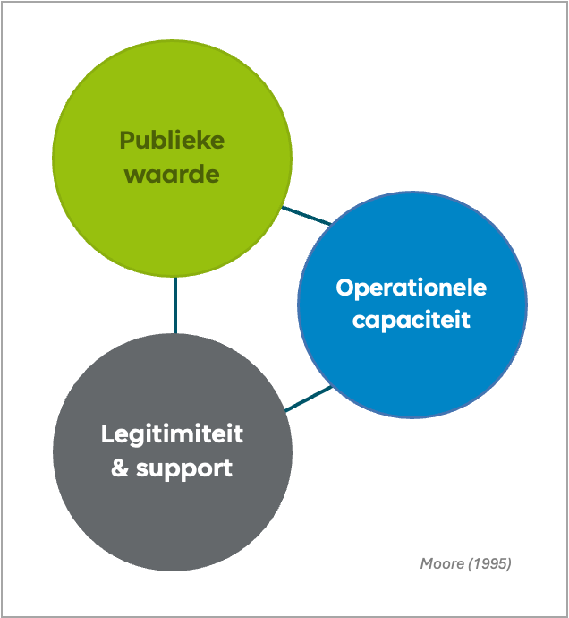
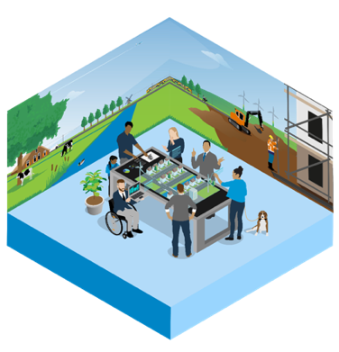

# Leren als fundament en vliegwiel {#7A98EDD4}
## Waarom een digitale tweeling lerend ontwikkelen & verankeren  {#1CC9EED9}
We hebben als burgers, publieke en private organisaties te maken met complexe opgaven. Deze complexiteit wordt onder andere veroorzaakt door de onderlinge samenhang tussen de opgaven en vele niet te beheersen factoren die de dynamiek van iedere opgave afzonderlijk maar ook als geheel beïnvloeden. Provincies en gemeenten staan aan de lat om de lijnen uit te zetten, met elkaar en met belanghebbenden. Data en technologie zoals digitale tweelingen kunnen als hulpmiddel helpen bij het integraal aanpakken van de opgaven. 
 
 
De valkuil is projecten of usecases waarin data en het ontwikkelen en in gebruik nemen van technologieën centraal staan, als een technologisch project in te richten. Het werken met data en nieuwe technologieën is echter geen doel op zich. Het zijn middelen die een ander doel moet dienen namelijk te komen tot duurzame integrale oplossingen voor maatschappelijke vraagstukken. Dat is de reden om de maatschappelijke opgave in de leermethodiek centraal te stellen en van daaruit op zoek te gaan naar de waarde van data en technologie voor deze opgave. 
Daarbij komt dat maatschappelijke vraagstukken organisatie- en gebiedsgrenzen overschrijden. Dat betekent dat provincies en gemeenten intern maar ook met extern met andere organisaties integraal samen moeten kunnen werken. Dat maakt het ontwikkelen en verankeren van digitale tweelingen, ofwel het multi-disciplinair samenwerken aan maatschappelijke vraagstukken, tot een gezamenlijk leerproces waarin alle betrokkenen met elkaar iteratief de nieuwe manier van werken met digitale tweelingen stap voor stap eigen maken.
 
 
Geonovum heeft een leer- en ontwikkelmethode ontwikkeld om dit veranderproces methodisch vorm te kunnen geven: de Innovatieleercyclus. In deze aanpak staat de maatschappelijke opgave centraal. Het maatschappelijke vraagstuk is het vertrekpunt voor het delen van data en ontwikkelen dan wel inzetten nieuwe technologieën, en niet andersom. Dit is essentieel aangezien besluitvorming de kern vormt van het overheidshandelen (Van der Steen 2024). De veronderstelling is dat het besluitvormingsproces met een digitale tweeling verbetert en maatschappelijke opgaven slimmer, sneller en met meer draagvlak kunnen worden gerealiseerd.
 
 
Van der Steen (2024) betoogt dat het om drie redenen essentieel is zorgvuldig en overwogen met data en AI-technologie aan de slag te gaan. Door de exponentiele groei van data en algoritmen, neemt de kennis over maatschappelijke fenomenen toe. Informatiesystemen kunnen daardoor verbanden ontdekken en tot oplossingen komen die voorheen niet te leggen waren of bedacht (Van der Steen 2024). Dit kunnen ook politieke zaken zijn die al dan niet door het systeem zelf worden geagendeerd. Deze ontwikkelingen kunnen verstrekkende gevolgen hebben voor het toedelen van materiële en immateriële waarden en de grondbeginselen van onze rechtstaat. Dit kwam ook in de usecases naar voren. Deelnemers brachten de noodzaak van expliciete en navolgbare besluiten ten behoeve van rechtszekerheid en rechtsgelijkheid naar voren, als een van de zaken die in een digitale tweeling geregeld moeten zijn. 
Daarom staat in de Innovatieleercyclus-methodiek de maatschappelijke opgave en maatschappelijke waarde centraal in plaats van de digitale tweeling technologie, en vormen opgavemanagers, beleidsmakers, (geo) dataspecialisten en andere bij de opgave betrokken professionals in de usecase-leeromgeving een gezamenlijk beeld te vormen over de richting en doel van digitale tweeling als instrument. Daarmee volgt deze leermethodiek de werkwijze die Van der Steen (2024) voorstelt voor het zorgvuldig ontwikkelen en toepassen van technologie door publieke waardecreatie centraal te stellen en de <i>Publieke Waarde Driehoek</i> van Mark Moore (1995) te gebruiken.  
<figure></img>
<figcaption><i>De Publieke Waarde Driehoek van Mark Moore (1995)</i></figcaption></figure>
 
De leermethode is er niet alleen op gericht het gesprek over de maatschappelijke opgave(n) en de waarde die data en technologie dienen op te leveren, op gang te brengen. Het draagt ook bij aan co-creatie, dat wil zeggen het over silo’s heen leren werken om integraal aan de opgaven te kunnen werken. Op die manier is het leerproces een fundament en werkt het tegelijkertijd als vliegwiel voor het verankeren van een interdisciplinaire door technologie ondersteunde werkwijze.
Op die manier sluiten we ook aan bij wat uit wetenschappelijk onderzoek naar voren met betrekking tot succesvolle innovaties. Het succes van een innovatie bestaat voor slechts 25% uit technologische aspecten en voor 75% uit wat Volberda & Bosma (2011, p.25) omschrijven als sociale aspecten. De Innovatieleercyclus helpt organisaties zowel op sociaal-organisatorisch als op technologisch vlak te innoveren, en het proces vanuit de dagelijkse werkpraktijk vorm te geven.
<table style='width: 100%;'><caption></caption>
<colgroup><col id='col1' style='width: 37.62522768670309%;'>
<col id='col2' style='width: 22.028688524590166%;'>
<col id='col3' style='width: 40.346083788706736%;'>
</colgroup>
<tbody><tr><td class='left' style='border-top: 0.5pt solid #A6A6A6; border-left: 0.5pt solid #A6A6A6; border-bottom: 0.5pt solid #A6A6A6; border-right: 0.5pt solid #A6A6A6; background-color: #D9D9D9;'>
<b>FASEN INNOVATIE</b>
</td>
<td class='left' style='border-top: 0.5pt solid #A6A6A6; border-left: 0.5pt solid #A6A6A6; border-bottom: 0.5pt solid #A6A6A6; border-right: 0.5pt solid #A6A6A6; background-color: #D9D9D9;'>
<b>MATE VAN HET INNOVATIESUCCES</b>
</td>
<td class='left' style='border-top: 0.5pt solid #A6A6A6; border-left: 0.5pt solid #A6A6A6; border-bottom: 0.5pt solid #A6A6A6; border-right: 0.5pt solid #A6A6A6; background-color: #D9D9D9;'>
<b>ASPECTEN VAN INVLOED OP DE MATE VAN HET INNOVATIESUCCES </b>
</td>
</tr>
<tr><td class='left' style='border-top: 0.5pt solid #A6A6A6; border-left: 0.5pt solid #A6A6A6; border-bottom: 0.5pt solid #A6A6A6; border-right: 0.5pt solid #A6A6A6; background-color: #F0F8FF;'>
Nieuwe technologie
</td>
<td class='left' style='border-top: 0.5pt solid #A6A6A6; border-left: 0.5pt solid #A6A6A6; border-bottom: 0.5pt solid #A6A6A6; border-right: 0.5pt solid #A6A6A6; background-color: #F0F8FF;'>
25% innovatiesucces
</td>
<td class='left' style='border-top: 0.5pt solid #A6A6A6; border-left: 0.5pt solid #A6A6A6; border-bottom: 0.5pt solid #A6A6A6; border-right: 0.5pt solid #A6A6A6; background-color: #F0F8FF;'>
Technologische innovatie: <ul><li>R&D</li>
<li>ICT</li>
<li>Technologie</li>
</ul>

</td>
</tr>
<tr><td class='left' style='border-top: 0.5pt solid #A6A6A6; border-left: 0.5pt solid #A6A6A6; border-bottom: 0.5pt solid #A6A6A6; border-right: 0.5pt solid #A6A6A6; background-color: #F0F8FF;'>
Herkennen, verwerven, integreren en toepassen technologie
</td>
<td class='left' style='border-top: 0.5pt solid #A6A6A6; border-left: 0.5pt solid #A6A6A6; border-bottom: 0.5pt solid #A6A6A6; border-right: 0.5pt solid #A6A6A6; background-color: #F0F8FF;'>
75% innovatiesucces
</td>
<td class='left' style='border-top: 0.5pt solid #A6A6A6; border-left: 0.5pt solid #A6A6A6; border-bottom: 0.5pt solid #A6A6A6; border-right: 0.5pt solid #A6A6A6; background-color: #F0F8FF;'>
Sociale innovatie:
<ul><li>Co-creëren </li>
<li>Flexibel organiseren</li>
<li>Slimmer werken</li>
<li>Dynamisch leiderschap</li>
<li>De innovatie verder brengen dan R&D</li>
</ul>
</td>
</tr>
</tbody>
</table>
<i>Tabel 1: </i><i>Volberda</i><i> & Bosma 2011 </i>
 
 
Sociale innoveren is geen sinecure. Het ‘herkennen, verwerven, integreren en toepassen’ van een digitale tweeling, anders gezegd<i> digital </i><i>twinning</i><i> </i>als werkwijze eigen maken en incorporeren zodat de voordelen ervan zichtbaar worden, is niet eenvoudig te realiseren. De leer-en ontwikkelmethode helpt dit werkende wijs op een lerende manier te doen.  

## Een usecase als leeromgeving  {#1C1ECCE2}
Voor de ontwikkeling van een digitale tweeling en verankering daarvan in de beleids- en besluitvormingsprocessen van organisaties, wordt de basis gelegd in een usecase. 
### Een usecase en het lerend ontwikkelen en verankeren van een digitale tweeling {#38CA3622}
Een usecase is een leeromgeving waarbinnen een team procesmatig werkt aan het inzichtelijk maken en beschrijven van:
<ul><li>het maatschappelijke vraagstuk waarvoor een digitale tweeling wordt ontwikkeld en met welk maatschappelijk doel</li>
<li>met en voor wie deze technologie wordt ontwikkeld, en wat de wensen en behoeften van deze belanghebbenden zijn</li>
<li>hoe beleidsmakers, (geo)dataspecialisten en andere bij de opgave betrokken functionarissen met het vraagstuk aan de slag te gaan. Welke activiteiten zij ondernemen, de besluiten die genomen moeten worden en de daaraan gekoppelde informatiebehoefte en databronnen</li>
<li>wat de digitale tweeling technisch moet kunnen en waarom dat voor de potentiële gebruiker(s) van belang is</li>
<li>hoe de digitale tweeling in praktijk functioneert </li>
<li>en welke lessen uit dit proces naar voren komen voor toekomstige usecases. </li>
</ul>
Dit met het doel een digitale tweeling als data en AI-technologie op rechtstatelijk verantwoorde wijze en de maatschappelijke opgave dienend, te ontwikkelen en verankeren in de organisatieprocessen. 
 
 
Het proces dat het usecaseteam doorloopt, bestaat uit een workshopreeks en daaropvolgende periodieke retrospectiefs. Tijdens de workshopreeks werkt een team van bij de maatschappelijke opgave betrokken beleidsmakers en (geo)dataspecialisten met behulp van het usecasecanvas aan een usecasebeschrijving op basis waarvan een digitale tweeling door (een) software-ontwikkelaar(s) wordt ontwikkeld. Gedurende deze ontwikkelperiode worden met het usecaseteam en de ontwikkelaar(s) periodieke retrospectiefs gehouden, waarmee het leerproces dat met de workshops is ingezet, op systematische wijze wordt gecontinueerd. Dit proces van leren ontwikkelen en verankeren is hieronder schematisch weergegeven. 
 
 
<figure></img>
<figcaption><i>Het usecaseproces</i></figcaption></figure>

### Het selecteren van een usecase en een interdisciplinair team vormen {#4EBCD8A7}
Het proces van lerend een digitale tweeling ontwikkelen en verankeren, kent een aantal rollen. Een provincie of gemeente brengt een maatschappelijk vraagstuk in, waarvoor zij een digitale tweeling willen ontwikkelen. Dit kunnen zij doen in samenwerking met andere overheden. De ‘usecase-ownende’ organisatie zorgt dat alles rondom de usecase wordt voorbereid en er een team wordt gevormd. Het is raadzaam dat de organisatie die een digitale tweeling wil ontwikkelen, voor de inhoudelijke aansturing daarvan een projectleider aanstelt.  
 
Het vraagstuk kan vanuit diverse (beleids)afdelingen en functionarissen bij de projectleider worden ingebracht. Het is van belang dat het eigenaarschap voor het vraagstuk en daarmee de usecase vanuit de opgave en/of beleidsafdeling wordt geregeld en niet bij de projectleider of de IT-afdeling ligt. Ook is het essentieel dat het team dat binnen een usecase samenwerkt, in ieder geval bestaat uit een actief betrokken eigenaar van het vraagstuk, beleids- en/of gebiedsprofessionals, opgavemanagers, onderzoeksprofessionals en (geo)data-experts van de bij het vraagstuk betrokken organisaties.  
 
Een van de leerpunten uit de uitgevoerde usecases bij Provincie Flevoland en Almere is dat het selecteren van een relevante maatschappelijke opgave voor een usecase, het enthousiasmeren en actief betrekken van de juiste bij de opgave betrokken functionarissen en organisaties, als ook het ‘in de steigers zetten’ en het eigenaarschap, niet van vandaag op morgen geregeld is maar veel tijd en aandacht en doorzettingsvermogen van een projectleider vraagt. Aangezien bij ieder maatschappelijk vraagstuk weer andere functionarissen en organisaties betrokken zijn, is de dynamiek van iedere usecase anders en verlopen zowel de voorbereidingsfase als de workshops iedere keer weer anders. Dat maakt het essentieel dat een projectleider niet alleen goed is in het managen van een project, maar vooral om weet te gaan met een continu veranderend krachtenveld, belangen en prioriteiten, en daar situationeel op in weet te spelen en resultaten boekt.  
 
Het is raadzaam om naast een projectleider een combinatie aan te stellen van een procesbegeleider met organisatie- en/of veranderkundige competenties en een inhoudelijk begeleider met een beleidsinformatie en/of data-technische achtergrond. Zij kunnen de projectleider in de voorbereidende fase ondersteunen, adviseren en helpen waar nodig. De procesbegeleider en inhoudelijk begeleider zorgen voor het vormgeven en voorbereiden, faciliteren en uitwerken van de workshops en de retrospectiefs. Dit alles vindt plaats in afstemming met de projectleider.
Daarnaast helpt de procesbegeleider de projectleider bij de dynamiek rond de usecase en het daaraan verbonden leerproces, zodat er een digitale tweeling in gebruik kan worden genomen die de doelen van het maatschappelijk vraagstuk ondersteunt. Kennis van en ervaring met organisatie(veranderings)processen, dynamiek van groepsprocessen binnen en tussen organisaties is essentieel.
De inhoudelijk begeleider adviseert en ondersteunt bij het ontwikkelen van opgave gerelateerde userstories en de technische ontwikkeling van de digitale tweeling. Deze rol kan goed door een (geo)data-expert of informatie-analist vervuld worden.

### Usecase in beeld brengen met een usecasecanvas {#0D10E7F8}
Voor het goed zicht krijgen op het maatschappelijke vraagstuk en wat dit betekent voor de te ontwikkelen digitale tweeling en de verankering daarvan in de organisatie, is een usecasecanvas ontwikkelt. Dit canvas wordt tijdens de workshops als hulpmiddel gebruikt en gaandeweg het proces gevuld. 
 
 
</img>
 
 
<figure></img>
<figcaption><i>Het usecasecanvas</i></figcaption></figure>
 
Het usecasecanvas vormt de basis voor een collectief leerproces van het usecaseteam. Het helpt een multidisciplinair usecaseteam van beleids- en/of gebieds-of opgaveprofessionals en geo-data-specialisten uit de bij het vraagstuk betrokken organisaties:
<table style='width: 100%'><caption></caption>
<colgroup><col id='col1' style='width: 64.5927470744989%'>
<col id='col2' style='width: 35.4072529255011%'>
</colgroup>
<tbody><tr><td class='left'>
<ul><li>systematisch en <i>agile</i> vanuit het maatschappelijk vraagstuk, de maatschappelijke doelen en beoogde maatschappelijke waarden een digitale tweeling te ontwikkelen </li>
<li>over silo’s en organisatiegrenzen heen te leren samenwerken</li>
<li>elkaar, elkaars werksituatie en uitdagingen leren kennen en begrijpen</li>
<li>een gemeenschappelijke taal ontwikkelen</li>
<li>een manier van werken te ontwikkelen om multidisciplinair en in- en externe stakeholders actief te betrekken en met hen samen te werken</li>
</ul>
</td>
<td class='left'></img>
</td>
</tr>
</tbody>
</table>

## De dynamiek tijdens het ontwikkelen en verankeren van een digitale tweeling  {#036BAD72}
Het ontwikkelen en gebruiken van een digitale tweeling verloopt niet zonder slag of stoot. De impact die het ontwikkelen en het werken met een digitale tweeling heeft op mensen, organisatiestructuren en (samen)werkprocessen, schept enerzijds nieuwe kansen en mogelijkheden. Anderzijds geeft het ook uitdagingen, onzekerheden en onrust. Dit laatste is een goed teken. Zoals Jansen en Swieringa treffend formuleren (2005): “<i>geen verandering zonder gedoe en zonder gedoe ook geen verandering”</i>. Tijdens het usecaseproces doen zich allerlei situaties voor: verwacht en onverwacht. De uitdaging is hier zo goed mogelijk mee leren omgaan, zodat het multidisciplinair en organisatie-overstijgend samenwerken aan maatschappelijke opgaven met behulp van een digitale tweeling werkelijkheid wordt. 
 
 
Vaak ligt de focus tijdens veranderingsprocessen, op het gestructureerd uitvoeren van concreet zichtbare ‘bovenstroomse’ activiteiten die leiden tot tastbare en het liefst meetbare resultaten (zie figuur 3). Het usecaseproces kan als bovenstroom worden gezien. Gedurende de verschillende fase van een veranderproces ofwel usecaseproces, doen zich situaties voor waarin mensen individueel en collectief met gedoe te maken krijgen. De uitdaging is tot inzichten, afspraken en routines te komen die de beoogde verandering bevorderen in plaats dat het aanleiding geeft om de handdoek in de ring te gooien. Tegelijkertijd komt niet al het gedoe aan de oppervlakte. Veel blijft onzichtbaar en ongrijpbaar in de <i>fuzzy</i> onderstroom. Dit kan de activiteiten die zichtbaar in de bovenstroom worden afgesproken en uitgevoerd alsnog frustreren. Deze vaak onzichtbare fuzzy en moeilijk te managen onderstroomprocessen, bepalen vaak het succes van activiteiten in de bovenstroom. Dan gaat het bijvoorbeeld om de technische ontwikkeling van een digitale tweeling of een architectuur waarmee het uitwisselen van data mogelijk wordt gemaakt. De Innovatieleercyclus helpt de bij de usecase betrokken partijen:
<ul><li>doorlopend aandacht te hebben voor zowel bovenstroomse activiteiten en onderstroomse dynamieken; </li>
<li>gedoe zoals conflicten, ruis, wantrouwen ofwel onderstroomprocessen te accepteren en ermee leren om te gaan;</li>
<li>werkende wijs zowel individueel als collectief een routine op te bouwen en competenties te ontwikkelen om boven- en onderstroom te verbinden en zo de beoogde projectresultaten te realiseren.       </li>
</ul>
<figure></img>
<figcaption><i>De Innovatieleercyclus verbindt boven- en onderstroom</i></figcaption></figure>

## Oorzaken voor ‘fuzziness’ in de onderstroom {#0B3F0B38}
Tijdens het ontwikkelen en verankeren van een digitale tweeling doen zich allerlei boven- en onderstroomse dynamieken voor. Niet alleen binnen de afzonderlijke bij de usecase betrokken organisaties, maar ook tussen de samenwerkende organisaties en hun vertegenwoordigers. De complexiteit van de dynamiek wordt gevoed doordat verschillende organisatieculturen en uiteenlopende persoonlijke, organisatie- en samenwerksbelangen, prioriteiten, vertrouwensrelaties en machtsverhoudingen dwars door elkaar heen bewegen en continu aan verandering onderhevig zijn. 
 
 
Zo kan voor een bepaalde usecase een samenwerking tussen bijvoorbeeld provincies, gemeenten, waterschappen, onderzoeksbureaus en software-ontwikkelaars veelbelovend en essentieel zijn voor het maatschappelijke vraagstuk dat centraal staat en de digitale tweeling die men wil ontwikkelen. Door samen te werken, kunnen de organisaties veel voordelen behalen. Bijvoorbeeld door kennis, faciliteiten, vaardigheden, reputatie, financiën en andere zaken uit te wisselen. Omdat organisaties en professionals van elkaar verschillen, kunnen ze elkaar versterken en tot innovatieve oplossingen komen. Ondanks deze voordelen en de kansen die dit met zich mee kan brengen, vergt het veel van organisaties om een ​​goed functionerend partnerschap met meerdere belanghebbenden op te zetten en te behouden. Er zijn veel redenen waarom een ​​partnerschap, ondanks alle inspanningen, uiteindelijk niet eens van start gaat of na een paar jaar uiteenvalt.
 
 
We zijn gewend om ons te concentreren op lineaire processen en op tastbare en meetbare activiteiten en resultaten die moeten worden uitgevoerd om de samenwerking rond een usecase tot stand te brengen (bovenstroom). Activiteiten zoals het maken van formele en informele afspraken over wat de betrokken organisaties bereid zijn uit te wisselen, over hoe er samen gewerkt wordt, wat aan wie en hoe er gecommuniceerd wordt en financiële aspecten. Of het doorlopen van het usecaseproces met workshops en als resultaat een usecasebeschrijving.
 
 
Echter, ontastbare en onbeheersbare onderstroomprocessen bepalen voor een groot deel het succes van de gezamenlijke usecase. Deze lastig grijpbare onderstroomprocessen worden gevoed door de asymmetrie tussen de partijen, ofwel de ongelijksoortigheid en de continu veranderende ongelijkwaardige machtsverhoudingen (Mijlhoff-Portier 2021). 
<table style='width: 100%;'><caption></caption>
<colgroup><col id='col1' style='width: 100%;'>
</colgroup>
<tbody><tr><td class='left' style='border-top: 0.5pt solid #A6A6A6; border-left: 0.5pt solid #A6A6A6; border-bottom: 0.5pt solid #A6A6A6; border-right: 0.5pt solid #A6A6A6; background-color: #D9D9D9;'>
<b>ASYMMETRIE TUSSEN SAMENWERKENDE ORGANISATIES</b>
</td>
</tr>
<tr><td class='left' style='border-top: 0.5pt solid #A6A6A6; border-left: 0.5pt solid #A6A6A6; border-bottom: 0.5pt solid #A6A6A6; border-right: 0.5pt solid #A6A6A6; background-color: #F0F8FF;'>
<b>Zichtbaar & tastbaar</b>
<ul><li>Organisatiekenmerken zoals omvang, kernactiviteit, leeftijd, marktaandeel</li>
<li>Organisatorische belangen zoals het realiseren van maatschappelijke doelen, groei, werkgelegenheid</li>
<li>Uitwisselbaarheden zoals middelen, investeringen, faciliteiten, netwerken, kennis en competenties</li>
</ul>
</td>
</tr>
<tr><td class='left' style='border-top: 0.5pt solid #A6A6A6; border-left: 0.5pt solid #A6A6A6; border-bottom: 0.5pt solid #A6A6A6; border-right: 0.5pt solid #A6A6A6; background-color: #F0F8FF;'>
<b>Onzichtbaar & relationeel</b>
<ul><li>Wederzijdse aannames, intenties, percepties, verwachtingen</li>
<li>Persoonlijke belangen zoals reputatie, posities en invloed</li>
<li>Gezamenlijke geschiedenis en bestaande vertrouwens- of conflictrelaties</li>
<li>Percepties over onderlinge asymmetrie 
</li>
</ul>
</td>
</tr>
</tbody>
</table>

<i>Tabel 2: Mijlhoff-Portier 2021</i>
 
 
Om als usecaseteam succesvol te zijn en zowel de ontwikkeling als de verankering van een digitale tweeling in de werkwijze van de deelnemende organisaties succesvol te laten verlopen, is het essentieel met de bovenstroom en de onderstroom rekening te houden. De betekenis en waarde van de asymmetrie en het samenwerkingsverband zelf worden beïnvloed door betrokken teamleden, hun in- en externe belanghebbenden, persoonlijke, organisatie en maatschappelijke belangen en daaraan gerelateerde prioriteiten (Mijlhoff-Portier 2021). Deze veranderen onophoudelijk. Daarom zullen de usecasedeelnemers voortdurend moeten navigeren tussen hun gezamenlijke usecase-activiteiten en hun achterban. Daarom is het van belang dat ze over de sensitiviteit en souplesse beschikken die nodig is om zich situationeel aan te kunnen passen aan het continu veranderende krachtenveld. Dat is nodig om vertrouwen en steun te krijgen en te behouden bij zowel hun eigen organisatie als de andere bij de usecase betrokken organisaties. 
## Omgaan met fuzzy onderstroom en georganiseerde bovenstroom {#161FB945}
De lastig grijpbare onderstroomdynamiek zorgen ervoor dat iedere usecase weer anders verloopt. 
Het usecaseproces met de workshopsreeks en het usecasecanvas fungeert als leidraad. De dynamiek zorgt ervoor dat iedere usecase een zekere mate van maatwerk nodig heeft waarbij usecasespecifieke accenten worden gelegd. 
 
 
Om over afdelingen en organisatiegrenzen heen samen te kunnen werken, is het van belang onophoudelijk rekening te houden met de verborgen dynamieken en asymmetrische verhoudingen en bedreven te raken in het opmerken ervan, het accepteren ervan en het ermee omgaan. Daarom richt de Innovatieleercyclus zich niet alleen op de data, technologie, het borgen van de nieuwe werkwijze die dat met zich meebrengt en de competenties die dat vraagt. De leermethodiek helpt ook om op systematische wijze stil te staan bij de onderlinge samenwerking en met belanghebbenden binnen de eigen organisatie en daarbuiten. Op die manier ontwikkelt het usecaseteam stap voor stap de adaptieve lenigheid die nodig is om mee te kunnen bewegen en zich waar nodig, aan te kunnen passen aan continu veranderende omstandigheden en dynamiek die het ontwikkelen en verankeren van een digitale tweeling met zich meebrengt. 
## Tot slot {#64301B9B}
Binnen de usecases van provincie Flevoland en gemeente Almere, wordt vanuit dit perspectief met behulp van de Innovatieleercyclus lerenderwijs gewerkt aan het ontwikkelen en het verankeren van een digitale tweeling. Het leer- en ontwikkelproces is erop gericht dit kort cyclisch, pragmatisch vanuit de opgave en de eigen werkpraktijk en met alle disciplines en stakeholders van betrokken publieke en private partijen, systematisch vorm te geven. Op die manier kan direct op de actualiteit worden ingespeeld en bekwamen de betrokken disciplines zich stap voor stap in de nieuwe werkwijzen en daarvoor benodigde competenties. Daarbij wordt een open structuur gehanteerd, zodat gedurende de verschillende fasen van het proces, meerdere collega’s en stakeholders kunnen worden aangehaakt.  
