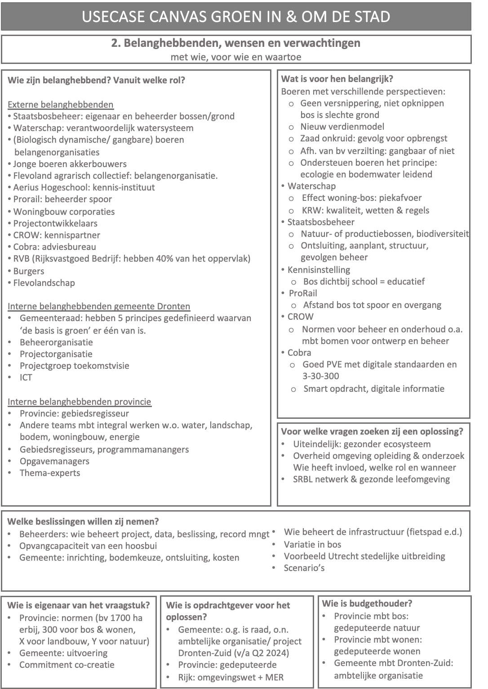

# De praktijk: lerend een digitale tweeling ontwikkelen & verankeren {#0934919D}
## Introductie  {#40C2D6F4}
De Innovatieleercyclus is een leermethodiek die teams van samenwerkende organisaties in kunnen zetten om op systematische wijze een digitale tweeling lerend te ontwikkelen en te verankeren. Dit tweede deel van de handleiding heeft als doel begeleiders van dit leerproces praktische handreikingen en hulmiddelen te bieden voor het:
<ul><li>voorbereiden van een usecase ofwel leeromgeving, </li>
<li>het begeleiden van usecaseworkshops om vanuit een concrete maatschappelijke opgave, maatschappelijke doelen en informatiebehoeften een digitale tweeling te ontwikkelen</li>
<li>en het begeleiden van periodieke retrospectiefsessies waarin het interdisciplinair team systematisch reflecteert en leert met betrekking tot waardecreatie van een digitale tweeling voor maatschappij en belanghebbenden, samenwerking binnen het usecaseteam en met belanghebbenden, en de ontwikkeling en verankering van een digitale tweeling. </li></ul>

## De voorbereidingsfase {#63F64583}
### Inbrengen van een maatschappelijk vraagstuk {#07029DAB}
De voorbereidingsfase staat in het teken van het selecteren van een maatschappelijk vraagstuk waarvoor een digitale tweeling van grote waarde kan zijn. Het idee kan vanuit verschillende kanten komen, van een opgavemanager, een beleidsadviseur of een digitaliseringsplan kan de aanleiding zijn. 
### De potentie van een maatschappelijk vraagstuk bepalen {#4B07BA70}
Afhankelijk van de precieze taakverdeling binnen de organisatie, is het raadzaam dat degene die verantwoordelijk is voor het ontwikkelen van een digitale tweeling (projectleider), de potentie van het maatschappelijk vraagstuk voor het ontwikkelen van een digitale tweeling verkent en de fase waarin de organisatie zich bevindt. Zo’n verkenning geeft de richting van de usecase aan. Ook laat het zien wat er voorafgaand aan de workshopreeks geregeld moet worden. 
Een procesbegeleider kan de projectleider ondersteunen met het scherp krijgen van het vraagstuk en een geo-dataspecialist of GIS-specialist kan helpen de informatiebehoefte op tafel te krijgen en hoe dit in een digitale tweeling of een ander informatieproduct vorm kan krijgen. Een hulpmiddel hierbij is het template Handreiking voor het selecteren van een usecase.
 
 
<table style='width: 100%;'><caption></caption>
<colgroup><col id='col1' style='width: 100%;'>
</colgroup>
<tbody>
<tr><td class='left' style='border-top: 0.5pt solid #A6A6A6; border-left: 0.5pt solid #A6A6A6; border-bottom: 0.5pt solid #A6A6A6; border-right: 0.5pt solid #A6A6A6; background-color: #F0F8FF;'>

<b>Handreiking voor het selecteren van een usecase</b>

 

<b>Het maatschappelijk vraagstuk en het belang van een digitale tweeling</b>
<ol>
  <li>Wat is het maatschappelijke vraagstuk dat moet worden opgelost?</li>
  <li>Hoe kan een digitale tweeling helpen bij het oplossen van het vraagstuk?</li>
  <li>Voor wie is het een vraagstuk?</li>
  <li>Welke opgave ligt hieraan grondslag?</li>
  <li>Wat zijn de grootste knelpunten?</li>
  <li>Wie heeft er last van?</li>
  <li>Zijn er inhoudelijk doelen gesteld? Zo ja, waar bestaan die uit?</li>
</ol> 
<b>Waar een digitale tweeling aan moet bijdragen</b>
<ol>
  <li>Waar moet een digitale tweeling aan voldoen, wil het voor jullie van waarde zijn?
    <ul><li>Welke functies van een digitale tweeling zie je voor je? Wat moet het kunnen?</li>
    <li>Welke wensen zijn er t.a.v. voorspellingen die jullie m.b.v. een digitale tweeling willen kunnen doen?</li>
    </ul></li>
  <li>Welke ethische dilemma’s voorzie je?
    <ul><li>Welke ideeën hebben jullie over hoe jullie daarmee om willen gaan?</li></ul></li>
  <li>Welke data denken jullie te willen gebruiken (open data, private of public data)?</li>
  <li>Welke meerwaarde/ facilitering verwacht je van de samenwerking tussen de usescases?
    <ul><li>M.b.t. de ontwikkeling van het maatschappelijk vraagstuk dat centraal staat?</li>
    <li>M.b.t. de ontwikkeling van de technologie</li></ul></li>
  <li>Welke ervaring hebben jullie al met het ontwikkelen van digitale tweelingen?
    <ul><li>Wat waren hierin positieve leerpunten?</li>
    <li>En tot welke aandachtspunten heeft dit geleid?</li>
    <li>Welke ervaring hebben jullie om dit vanuit maatschappelijke opgave te doen?</li></ul></li>
</ol> 
<b>Interne en externe samenwerkingspartners & belanghebbenden</b>
<ol>
  <li>Welke <u>interne</u> opgave- en beleidsinhoudelijke medewerkers heb je voor ogen om het vraagstuk mee op te pakken en de digitale tweeling te ontwikkelen? 
    <ul><li>Welke rol hebben deze medewerkers m.b.t. het vraagstuk, of zouden ze moeten hebben?</li>
    <li>In hoeverre zijn zij op de hoogte van dit initiatief?</li></ul></li>
  <li>En welke <u>externe</u> opgave- en beleidsinhoudelijke medewerkers?
  <ul><li>In hoeverre zijn zij op de hoogte?</li>
    <li>In hoeverre zijn zij op de hoogte van dit initiatief?</li></ul></li>
  <li>In hoeverre wordt er al met bedrijven samengewerkt voor het ontwikkelen/faciliteren van technologie voor digitale tweelingen?
    <ul><li>In hoeverre willen jullie aan deze samenwerkingsrelaties vasthouden?</li></ul></li>
  <li>Wat moeten jullie regelen om voldoende draagvlak binnen en buiten de organisatie te krijgen voor het starten van een usecase? 
    <ol><li>Wie zijn jullie interne stakeholders? Wie zijn jullie externe stakeholders?</li>
    <li>Wie is eigenaar van het maatschappelijk vraagstuk?</li>
    <li>In hoeverre is de eigenaar al bij de plannen voor een usecase betrokken?</li>
    <li>In hoeverre hebben jullie goedkeuring en financiële middelen om een usecase te starten?</li>
    <li>Wie is bepalend bij de besluitvorming?</li></ol></li></ol>

</td></tr></tbody></table>
<i>Tabel 3: handreiking selecteren </i><i>usecase</i>

### Het formeren van een (interdisiplinair)(interorganisationeel) team {#75D46700}
Als het maatschappelijk vraagstuk geschikt is voor het inrichten van een leeromgeving ofwel het starten van een usecase waarin een digitale tweeling voor het betreffende vraagstuk wordt ontwikkeld, is het zaak een team te formeren. Het is belangrijk om (voor zover dat in deze fase is in te schatten en noodzakelijk is) alle bij het maatschappelijk vraagstuk betrokken medewerkers binnen de eigen organisatie en daarbuiten, te betrekken. Ook is het essentieel dat opgave- en beleidsinhoudelijke medewerkers actief deelnemen. Het ideale usecase-team bestaat in ieder geval uit:
<ul><li>Opgavemanagers en/of beleidsinhoudelijke professionals voor kennis- en expertise van maatschappelijke opgaven, beleidsvoorbereidende, besluitvormings- en uitvoeringsprocessen en de daaraan verbonden informatiebehoeften. Zij zijn de vragende partij, degenen die belang (moeten) hebben bij een digitale tweeling. </li>
<li>Informatie- en (geo)dataspecialisten voor kennis- en expertise van het vertalen van beleidsgerelateerde informatievragen naar data- en technologieën om de door de opgavemanagers en/of beleidsmakers gevraagde inzichten verschaffen.</li>
<li>Projectleider voor het managen van het project en de realisatie van een digitale tweeling. Kennis en ervaring van het begeleiden van usecase-teams in dynamische innovatieprocessen is sterk aan te bevelen.  </li>
<li>Procesbegeleider met kennis en ervaring van veranderkundige interdisciplinaire leer- & ontwikkelprocessen in samenwerkingsverbanden van publiek en private organisaties. </li>
<li>Procesbegeleider met inhoudelijke kennis en ervaring met het vertalen van beleidsvragen naar informatie-, data en technologie.</li>
</ul>
 
 
Aangezien ieder vraagstuk anders is, zal ook de samenstelling van het soort functionarissen en de mate waarin zij betrokken zijn, per usecase verschillend zijn. Het is echter essentieel dat voor ieder vraagstuk, in het usecaseteam altijd opgave- en beleidsinhoudelijke professionals vertegenwoordigd zijn, aangezien zij de vragende partij zijn.
Het vraagt van de projectleider flexibiliteit en adaptieve vaardigheden om zich situationeel aan continu veranderende omstandigheden en intern (politieke) dynamiek aan te passen, om tot een goede usecase met passend usecaseteam te komen.

## Usecaseworkshops {#00B77D4A}
### Doel usecaseworkshops {#3B002B40}
De usecaseworkshop-reeks heeft twee doelstellingen. Enerzijds zijn de usecaseworkshops gericht op de technologie: het ontwikkelen van een werkende digitale tweeling die door gebruikers wordt ingezet ten behoeve van het maatschappelijke vraagstuk dat in de usecase centraal staat. Daarvoor is het belangrijk op systematische wijze het maatschappelijke vraagstuk binnen de brede omgeving van belanghebbenden te ontleden en te vertalen naar concrete doelen, informatiebehoeften en de gewenste functionaliteiten van toekomstige gebruikers van de digitale tweeling.  
Anderzijds is het doorlopen van de usecaseworkshops gericht op het veranderproces naar het eigen maken en incorporeren van de nieuwe werkwijze: het met behulp van data en technologie interdisiplinair interorganisationeel samenwerken aan maatschappelijke vraagstukken. Het Usecasecanvas functioneert ook als samenwerkingstool voor opgave- of beleidsinhoudelijke en (geo)dataspecialisten om:
<ul><li>concreet met de opgave aan de slag te gaan</li>
<li>en tegelijk een basis te leggen voor het gezamenlijke leerproces</li>
<li>met elkaar te experimenteren en te leren wat er nodig is om op basis van een maatschappelijk vraagstuk tot een werkende digitale tweeling te komen  </li>
<li>over silo’s en organisatiegrenzen heen met elkaar en stakeholder met een digitale tweeling te leren samenwerken aan maatschappelijke vraagstukken</li>
<li>elkaar, elkaars werksituatie en uitdagingen te leren kennen en begrijpen</li>
<li>een gemeenschappelijke taal ontwikkelen</li>
<li>een gezamenlijk beeld creëren van het maatschappelijk vraagstuk, de complexiteit van de omgeving en stakeholderbelangen, de beoogde waarde en doelen van een gezamenlijke digitale tweeling</li>
<li>goed zicht te krijgen op wat er nodig is voor de verankering van de nieuwe werkwijze in de organisatie. </li></ul>

### Inhoud en vorm van de usecaseworkshops {#15C8896F}
Het usecaseproces (afbeelding 2) en het usecasecanvas (afbeelding 3) geven een richting voor de inhoud van de usecaseworkshops en de onderwerpen die per workshop aan de orde komen. Daar komt bij dat ieder maatschappelijk vraagstuk een eigen complexiteit kent, en ieder usecaseteam over een eigen dynamiek en kennisniveau beschikt. Beide aspecten zijn van grote invloed op de uiteindelijke vorm van de workshops. Dat is de reden dat de competenties van een procesbegeleider onmisbaar zijn om tot een goede articulatie van de vraag te komen en tegelijk het groepsproces te begeleiden. 
 
 
Een ervaren procesbegeleider heeft inzicht in groepsprocessen, doorziet wat een usecaseteam nodig heeft en beschikt over de nodige creativiteit om te bepalen welke werkvormen helpen de doelen van de verschillende workshops te bereiken. De complexiteit van het maatschappelijke vraagstuk, de groepsdynamiek en het kennisniveau maken dat iedere usecase en de daar aangekoppelde workshopreeks qua proces, accenten in de inhoud en toegepaste werkvormen verschillend is. Zo kan het betekenen bepaalde thema’s extra aandacht vragen of dat er extra workshops nodig zijn. Dit vraagt van zowel de procesbegeleider als het usecaseteam en projectleider de nodige flexibiliteit om dit te regelen, niet alleen persoonlijk of als team maar ook met de eigen achterban. 
 
 
De volgende paragrafen gaan per usecaseworkshop in op de inhoud. Ook geven de paragrafen handreikingen en tips voor hoe de workshops inhoud en vorm kunnen krijgen. Iedere procesbegeleider kan hier zijn of haar eigen variaties op maken.

### Workshop 1: maatschappelijke en stakeholderwaarde {#1E97E91E}
<i>Doel van workshop 1</i>
Tijdens de eerste workshop wordt het richting en het doel van de usecase bepaalt. Het heeft een verkennend en divergerend karakter. Gaandeweg de andere workshops wordt op de onderwerpen uit deze eerste workshop teruggegrepen en wordt geconvergeerd. 
 
 
<figure></img>
<figcaption><i>De usecaseworkshops en het proces van divergeren en convergeren </i></figcaption></figure>
 
 
Het doel van de workshop is enerzijds het vraagstuk in beeld brengen waarvoor een digitale tweeling wordt ontwikkeld en anderzijds een team te gaan vormen. Daarom staat deze eerste workshop in het teken van het met elkaar ontdekken en zicht krijgen op welk maatschappelijk vraagstuk het usecaseteam wil oplossen waarom, de waarde die dat de maatschappij moet opleveren, met wie en voor wie het usecaseteam dat wil oplossen. 
<i>Voorbeeld agenda </i>
Trek voor de workshop voldoende tijd uit, een dagdeel van 4 uur is aan te bevelen.
<table style='width: 100%;'><caption></caption>
<colgroup><col id='col1' style='width: 4.871557509835686%;'>
<col id='col2' style='width: 67.24137931034483%;'>
<col id='col3' style='width: 27.88706317981949%;'>
</colgroup>
<tbody><tr><td class='left' style='border-top: 0.5pt solid #000000; border-left: 0.5pt solid #000000; border-bottom: 0.5pt solid #000000; border-right: 0.5pt solid #000000; background-color: #F2F2F2;'></td>
<td class='left' style='border-top: 0.5pt solid #000000; border-left: 0.5pt solid #000000; border-bottom: 0.5pt solid #000000; border-right: 0.5pt solid #000000; background-color: #F2F2F2;'>
<b>AGENDA </b>
</td>
<td class='left' style='border-top: 0.5pt solid #000000; border-left: 0.5pt solid #000000; border-bottom: 0.5pt solid #000000; border-right: 0.5pt solid #000000; background-color: #F2F2F2;'></td>
</tr>
<tr><td class='left' style='border-top: 0.5pt solid #000000; border-left: 0.5pt solid #000000; border-bottom: 0.5pt solid #000000; border-right: 0.5pt solid #000000; background-color: #F2F2F2;'>
1 
</td>
<td class='left' style='border-top: 0.5pt solid #000000; border-left: 0.5pt solid #000000; border-bottom: 0.5pt solid #000000; border-right: 0.5pt solid #000000; background-color: #F2F2F2;'>
Welkom & introductie workshop
</td>
<td class='left' style='border-top: 0.5pt solid #000000; border-left: 0.5pt solid #000000; border-bottom: 0.5pt solid #000000; border-right: 0.5pt solid #000000; background-color: #F2F2F2;'>
Projectleider
</td>
</tr>
<tr><td class='left' style='border-top: 0.5pt solid #000000; border-left: 0.5pt solid #000000; border-bottom: 0.5pt solid #000000; border-right: 0.5pt solid #000000; background-color: #F2F2F2;'>
2
</td>
<td class='left' style='border-top: 0.5pt solid #000000; border-left: 0.5pt solid #000000; border-bottom: 0.5pt solid #000000; border-right: 0.5pt solid #000000; background-color: #F2F2F2;'>
Toelichting usecasemethodiek, workshop & agenda
</td>
<td class='left' style='border-top: 0.5pt solid #000000; border-left: 0.5pt solid #000000; border-bottom: 0.5pt solid #000000; border-right: 0.5pt solid #000000; background-color: #F2F2F2;'>
Procesbegeleider
</td>
</tr>
<tr><td class='left' style='border-top: 0.5pt solid #000000; border-left: 0.5pt solid #000000; border-bottom: 0.5pt solid #000000; border-right: 0.5pt solid #000000; background-color: #F2F2F2;'>
3
</td>
<td class='left' style='border-top: 0.5pt solid #000000; border-left: 0.5pt solid #000000; border-bottom: 0.5pt solid #000000; border-right: 0.5pt solid #000000; background-color: #F2F2F2;'>
Kennismaking  

</td>
<td class='left' style='border-top: 0.5pt solid #000000; border-left: 0.5pt solid #000000; border-bottom: 0.5pt solid #000000; border-right: 0.5pt solid #000000; background-color: #F2F2F2;'>
Allen, onder begeleiding van de procesbegeleider
</td>
</tr>
<tr><td class='left' style='border-top: 0.5pt solid #000000; border-left: 0.5pt solid #000000; border-bottom: 0.5pt solid #000000; border-right: 0.5pt solid #000000; background-color: #F2F2F2;'>
4
</td>
<td class='left' style='border-top: 0.5pt solid #000000; border-left: 0.5pt solid #000000; border-bottom: 0.5pt solid #000000; border-right: 0.5pt solid #000000; background-color: #F2F2F2;'>
De usecase in kaart brengen 
</td>
<td class='left' style='border-top: 0.5pt solid #000000; border-left: 0.5pt solid #000000; border-bottom: 0.5pt solid #000000; border-right: 0.5pt solid #000000; background-color: #F2F2F2;'>
Allen, onder begeleiding van de procesbegeleider
</td>
</tr>
<tr><td class='left' style='border-top: 0.5pt solid #000000; border-left: 0.5pt solid #000000; border-bottom: 0.5pt solid #000000; border-right: 0.5pt solid #000000; background-color: #F2F2F2;'>
5
</td>
<td class='left' style='border-top: 0.5pt solid #000000; border-left: 0.5pt solid #000000; border-bottom: 0.5pt solid #000000; border-right: 0.5pt solid #000000; background-color: #F2F2F2;'>
Wrap up, vervolgstappen & volgende workshop
</td>
<td class='left' style='border-top: 0.5pt solid #000000; border-left: 0.5pt solid #000000; border-bottom: 0.5pt solid #000000; border-right: 0.5pt solid #000000; background-color: #F2F2F2;'>
Allen, onder begeleiding van de procesbegeleider
</td>
</tr>
<tr><td class='left' style='border-top: 0.5pt solid #000000; border-left: 0.5pt solid #000000; border-bottom: 0.5pt solid #000000; border-right: 0.5pt solid #000000; background-color: #F2F2F2;'>
6
</td>
<td class='left' style='border-top: 0.5pt solid #000000; border-left: 0.5pt solid #000000; border-bottom: 0.5pt solid #000000; border-right: 0.5pt solid #000000; background-color: #F2F2F2;'>
Afsluiting
</td>
<td class='left' style='border-top: 0.5pt solid #000000; border-left: 0.5pt solid #000000; border-bottom: 0.5pt solid #000000; border-right: 0.5pt solid #000000; background-color: #F2F2F2;'>
Projectleider
</td>
</tr>
</tbody>
</table>

<i>Tips voor werkvormen en hulpmiddelen</i>
<ul><li>Agendapunt 3<ul><li>Kies een interactieve werkvorm die past bij de groepsgrootte (zie bijlage <i>literatuur faciliteren van groepsprocessen, workshops en werkvormen</i> voor inspiratie)</li>
</ul>
</li>
<li>Agendapunt 4<ul><li>Werkvorm: een World Café opstelling met een plenaire terugkoppeling</li>
<li>Hulpmiddel: eerste twee onderwerpen (maatschappelijke waarde en belanghebbenden, wensen & verwachtingen) geprint op A0-formaat</li>
</ul>
</li>
<li>Uitwerking resultaten<ul><li>De uitwerking kan op het canvas worden vertaald</li>
</ul>
</li>
</ul>
 
 
<figure></img>
</img>
<figcaption><i>Voorbeeld uitwerking workshop 1</i></figcaption></figure>

### Workshop 2: het ontwerp {#7AE623D6}
<i>Doel van workshop 2</i>
De eerste workshop genereert over het algemeen veel ideeën voor het vraagstuk dat in de usecase centraal staat. De kunst is om op basis van een review door de deelnemers de opbrengsten uit deze eerste workshop, tot een prioritering of een scherpere definitie te komen voor het maatschappelijke vraagstuk waar het usecaseteam zich met de te ontwikkelen digitale tweeling op wil focussen. Ook is het van belang dat het usecaseteam een keus maakt voor een specifiek gebied of een wijk voor de te ontwikkelen digitale tweeling. Deze focus is essentieel om de complexiteit van een digitale tweeling en de gewenste functionaliteiten en rekenmodellen overzichtelijk te houden.
 
 
Het tweede doel van deze workshop is om met elkaar een beeld te krijgen van hoe:
<ul><li>het beleidsproces met betrekking tot het vraagstuk eruitziet</li>
<li>ieders rol en activiteiten in het proces om tot beleidsontwikkeling, uitvoering en monitoring van het vraagstuk te komen</li>
<li>de besluiten die genomen worden </li>
<li>en de inzichten en informatie daarbij nodig zijn</li>
<li>welke databronnen daarvoor nodig zijn</li>
</ul>
Het in beeld gebrachte proces geeft inzicht in de potentiële gebruikers van de te ontwikkelen digitale tweeling. Ook geeft het richting aan de user stories die in de deelworkshops rond deze potentiële gebruikers worden opgesteld.
 
 
<i> 
Voorbeeld agenda</i>
Ook voor deze workshop is het raadzaam een dagdeel van 4 uur uit te trekken.
<table style='width: 100%;'><caption></caption>
<colgroup><col id='col1' style='width: 4.792805100182149%;'>
<col id='col2' style='width: 66.15437158469946%;'>
<col id='col3' style='width: 29.0528233151184%;'>
</colgroup>
<tbody><tr><td class='left' style='border-top: 0.5pt solid #A6A6A6; border-left: 0.5pt solid #A6A6A6; border-bottom: 0.5pt solid #A6A6A6; border-right: 0.5pt solid #000000; background-color: #F2F2F2;'></td>
<td class='left' style='border-top: 0.5pt solid #A6A6A6; border-left: 0.5pt solid #000000; border-bottom: 0.5pt solid #A6A6A6; border-right: 0.5pt solid #000000; background-color: #F2F2F2;'>
<b>AGENDA </b>
</td>
<td class='left' style='border-top: 0.5pt solid #A6A6A6; border-left: 0.5pt solid #000000; border-bottom: 0.5pt solid #A6A6A6; border-right: 0.5pt solid #A6A6A6; background-color: #F2F2F2;'></td>
</tr>
<tr><td class='left' style='border-top: 0.5pt solid #A6A6A6; border-left: 0.5pt solid #A6A6A6; border-bottom: 0.5pt solid #A6A6A6; border-right: 0.5pt solid #808080; background-color: #F2F2F2;'>
1 
</td>
<td class='left' style='border-top: 0.5pt solid #A6A6A6; border-left: 0.5pt solid #808080; border-bottom: 0.5pt solid #A6A6A6; border-right: 0.5pt solid #808080; background-color: #F2F2F2;'>
Welkom & introductie workshop
</td>
<td class='left' style='border-top: 0.5pt solid #A6A6A6; border-left: 0.5pt solid #808080; border-bottom: 0.5pt solid #A6A6A6; border-right: 0.5pt solid #A6A6A6; background-color: #F2F2F2;'>
Projectleider
</td>
</tr>
<tr><td class='left' style='border-top: 0.5pt solid #A6A6A6; border-left: 0.5pt solid #A6A6A6; border-bottom: 0.5pt solid #A6A6A6; border-right: 0.5pt solid #808080; background-color: #F2F2F2;'>
2
</td>
<td class='left' style='border-top: 0.5pt solid #A6A6A6; border-left: 0.5pt solid #808080; border-bottom: 0.5pt solid #A6A6A6; border-right: 0.5pt solid #808080; background-color: #F2F2F2;'>
Toelichting workshop & agenda
</td>
<td class='left' style='border-top: 0.5pt solid #A6A6A6; border-left: 0.5pt solid #808080; border-bottom: 0.5pt solid #A6A6A6; border-right: 0.5pt solid #A6A6A6; background-color: #F2F2F2;'>
Procesbegeleider
</td>
</tr>
<tr><td class='left' style='border-top: 0.5pt solid #A6A6A6; border-left: 0.5pt solid #A6A6A6; border-bottom: 0.5pt solid #A6A6A6; border-right: 0.5pt solid #808080; background-color: #F2F2F2;'>
3
</td>
<td class='left' style='border-top: 0.5pt solid #A6A6A6; border-left: 0.5pt solid #808080; border-bottom: 0.5pt solid #A6A6A6; border-right: 0.5pt solid #808080; background-color: #F2F2F2;'>
Het centrale vraagstuk en doel van de usecase
<ul><li>Scope aanbrengen in de opbrengst van workshop 1</li>
</ul>
</td>
<td class='left' style='border-top: 0.5pt solid #A6A6A6; border-left: 0.5pt solid #808080; border-bottom: 0.5pt solid #A6A6A6; border-right: 0.5pt solid #A6A6A6; background-color: #F2F2F2;'>
Allen, onder begeleiding van de procesbegeleider
</td>
</tr>
<tr><td class='left' style='border-top: 0.5pt solid #A6A6A6; border-left: 0.5pt solid #A6A6A6; border-bottom: 0.5pt solid #A6A6A6; border-right: 0.5pt solid #808080; background-color: #F2F2F2;'>
4
</td>
<td class='left' style='border-top: 0.5pt solid #A6A6A6; border-left: 0.5pt solid #808080; border-bottom: 0.5pt solid #A6A6A6; border-right: 0.5pt solid #808080; background-color: #F2F2F2;'>
Hoe we met het vraagstuk aan de slag gaan 
<ul><li>De activiteiten die plaatsvinden en de beslissingen die worden genomen</li>
<li>Wie welke activiteit uitvoert of besluit neemt</li>
<li>De inzichten en informatie die daarvoor nodig zijn</li>
<li>De databronnen die deze inzichten en informatie kunnen genereren</li>
</ul>
</td>
<td class='left' style='border-top: 0.5pt solid #A6A6A6; border-left: 0.5pt solid #808080; border-bottom: 0.5pt solid #A6A6A6; border-right: 0.5pt solid #A6A6A6; background-color: #F2F2F2;'>
Allen, onder begeleiding van de procesbegeleider
</td>
</tr>
<tr><td class='left' style='border-top: 0.5pt solid #A6A6A6; border-left: 0.5pt solid #A6A6A6; border-bottom: 0.5pt solid #A6A6A6; border-right: 0.5pt solid #808080; background-color: #F2F2F2;'>
5
</td>
<td class='left' style='border-top: 0.5pt solid #A6A6A6; border-left: 0.5pt solid #808080; border-bottom: 0.5pt solid #A6A6A6; border-right: 0.5pt solid #808080; background-color: #F2F2F2;'>
Wrap up, vervolgstappen & volgende workshop
</td>
<td class='left' style='border-top: 0.5pt solid #A6A6A6; border-left: 0.5pt solid #808080; border-bottom: 0.5pt solid #A6A6A6; border-right: 0.5pt solid #A6A6A6; background-color: #F2F2F2;'>
Allen, onder begeleiding van de procesbegeleider
</td>
</tr>
<tr><td class='left' style='border-top: 0.5pt solid #A6A6A6; border-left: 0.5pt solid #A6A6A6; border-bottom: 0.5pt solid #A6A6A6; border-right: 0.5pt solid #808080; background-color: #F2F2F2;'>
6
</td>
<td class='left' style='border-top: 0.5pt solid #A6A6A6; border-left: 0.5pt solid #808080; border-bottom: 0.5pt solid #A6A6A6; border-right: 0.5pt solid #808080; background-color: #F2F2F2;'>
Afsluiting
</td>
<td class='left' style='border-top: 0.5pt solid #A6A6A6; border-left: 0.5pt solid #808080; border-bottom: 0.5pt solid #A6A6A6; border-right: 0.5pt solid #A6A6A6; background-color: #F2F2F2;'>
Projectleider
</td>
</tr>
</tbody>
</table>

<i>Tips voor werkvormen en hulpmiddelen</i>
<ul><li>Agendapunt 3<ul><li>Een ‘prioriteringsvraag’ of ‘prioriteringstool’ zoals de ranking-tool in mentimeter is een effectief middel om focus aan te brengen in een hoeveelheid van ideeën en tot prioritering van het maatschappelijke vraagstuk dat tijdens de ontwikkeling van een digitale tweeling centraal staat.</li>
</ul>
</li>
</ul>
 
 
<figure></img>
<figcaption><i>Een voorbeeld van een Mentimeter om tot een prioritering te komen van het vraagstuk waarop het secaseteam zich met de digitale tweeling op wilde richten. Hieruit is de usecase ‘Wateroverlast ten gevolge van een hoosbui’ ontstaan.</i></figcaption></figure>
 
 
<ul><li>Een samenvatting (die door de procesbegeleider wordt voorbereid) kan helpen als ‘praatplaat’ om tot een scherpere definitie van het vraagstuk te komen</li>
</ul>
 
 
<figure></img>
<figcaption><i>Een voorbeeld van een samenvatting voor de usecase Hittestress.</i></figcaption></figure>
 
 
Agendapunt 4
<ul><li>Hieronder is een voorbeeld gegeven van hoe een in kaart gebracht proces eruit kan zien, met daarbij een eerste inventarisatie van de benodigde inzichten, informatie en databronnen.</li>
</ul>
<figure></img>
<figcaption><i>Een voorbeeld van een processchema </i></figcaption></figure>
 
 
<ul><li>Voor sommige usecaseteams kan het door het abstractieniveau die deze exercitie vergt, lastig zijn om het proces vorm te geven. Dan kan voor een andere invulling van dit agendapunt worden gekozen. Bijvoorbeeld: door de vier fasen van de beleidscyclus als uitgangspunt te nemen en met elkaar een beeld te vormen van de functionaliteiten die het usecaseteam per fase van de beleidscyclus nodig denkt te hebben van een digitale tweeling. Dit kan er als volgt uitzien.  
</li>
</ul>
<figure></img>
<figcaption><i>Een voorbeeld de gewenste functionaliteiten van een digitale tweeling per fase van de beleidscyclus</i></figcaption></figure>

### Deelworkshop: user stories {#560636BB}
<i>Doel van deelworkshop User </i><i>stories</i>
De deelworkshop User stories is erop gericht om op basis van de uitkomsten uit twee voorgaande workshops, de functionaliteiten van de te ontwikkelen digitale tweelingen vanuit het oogpunt van toekomstige gebruikers te beschrijven. Een goede user story beschrijft wat het systeem, de digitale tweeling, moet doen.
 
 
Een user story helpt het ontwikkelteam en andere belanghebbenden te begrijpen wat er moet worden gebouwd en waarom. Het is een instrument dat helpt om in elke fase van het ontwikkelproces waarde toe te voegen. 
Een user story geeft ook meetbare criteria voor succes. De (tussen)resultaten van de digitale tweeling die tijdens de Prototestingfase door het ontwikkelteam worden getoond, kunnen aan de hand van de user stories worden getest. 
Daarnaast is het een krachtig communicatiemiddel:
<ul><li>Voor het usecaseteam<ul><li>We hebben elkáár in beeld​</li>
<li>We hebben de behoefte goed in beeld​</li>
<li>We hebben de gewenste techniek in beeld​</li>
<li>We hebben op hoofdlijnen hetzelfde beeld</li>
</ul>
</li>
<li>Naar belanghebbenden toe<ul><li>Bredere groep gebruikers </li>
<li>Opdrachtgever, leiddinggevenden en andere stakeholders</li>
</ul>
</li>
<li>Om verwachtingen te managen </li>
</ul>
 
 
<i>Deelnemers</i>
Deze deelworkshop wordt in de regel gehouden met de opgave- en beleidsinhoudelijke professionals, informatie- en (geo)dataspecialisten die ook in voorgaande workshops participeerden. Het kan echter nuttig zijn om meer of andere toekomstige gebruikers aan te laten sluiten. Dan is dit zeker aan te raden.
 
 
<i>Agendavoorbeeld</i>
<table style='width: 100%;'><caption></caption>
<colgroup><col id='col1' style='width: 4.871557509835686%;'>
<col id='col2' style='width: 67.24137931034483%;'>
<col id='col3' style='width: 27.88706317981949%;'>
</colgroup>
<tbody><tr><td class='left' style='border-top: 0.5pt solid #000000; border-left: 0.5pt solid #000000; border-bottom: 0.5pt solid #000000; border-right: 0.5pt solid #000000; background-color: #F2F2F2;'></td>
<td class='left' style='border-top: 0.5pt solid #000000; border-left: 0.5pt solid #000000; border-bottom: 0.5pt solid #000000; border-right: 0.5pt solid #000000; background-color: #F2F2F2;'>
<b>AGENDA </b>
</td>
<td class='left' style='border-top: 0.5pt solid #000000; border-left: 0.5pt solid #000000; border-bottom: 0.5pt solid #000000; border-right: 0.5pt solid #000000; background-color: #F2F2F2;'></td>
</tr>
<tr><td class='left' style='border-top: 0.5pt solid #000000; border-left: 0.5pt solid #000000; border-bottom: 0.5pt solid #000000; border-right: 0.5pt solid #000000; background-color: #F2F2F2;'>
1 
</td>
<td class='left' style='border-top: 0.5pt solid #000000; border-left: 0.5pt solid #000000; border-bottom: 0.5pt solid #000000; border-right: 0.5pt solid #000000; background-color: #F2F2F2;'>
Welkom & introductie workshop
</td>
<td class='left' style='border-top: 0.5pt solid #000000; border-left: 0.5pt solid #000000; border-bottom: 0.5pt solid #000000; border-right: 0.5pt solid #000000; background-color: #F2F2F2;'>
Projectleider
</td>
</tr>
<tr><td class='left' style='border-top: 0.5pt solid #000000; border-left: 0.5pt solid #000000; border-bottom: 0.5pt solid #000000; border-right: 0.5pt solid #000000; background-color: #F2F2F2;'>
2
</td>
<td class='left' style='border-top: 0.5pt solid #000000; border-left: 0.5pt solid #000000; border-bottom: 0.5pt solid #000000; border-right: 0.5pt solid #000000; background-color: #F2F2F2;'>
Toelichting agenda in relatie tot de andere workshops
</td>
<td class='left' style='border-top: 0.5pt solid #000000; border-left: 0.5pt solid #000000; border-bottom: 0.5pt solid #000000; border-right: 0.5pt solid #000000; background-color: #F2F2F2;'>
Procesbegeleider
</td>
</tr>
<tr><td class='left' style='border-top: 0.5pt solid #000000; border-left: 0.5pt solid #000000; border-bottom: 0.5pt solid #000000; border-right: 0.5pt solid #000000; background-color: #F2F2F2;'>
3
</td>
<td class='left' style='border-top: 0.5pt solid #000000; border-left: 0.5pt solid #000000; border-bottom: 0.5pt solid #000000; border-right: 0.5pt solid #000000; background-color: #F2F2F2;'>
Toelichting user story 
<ul><li>Beelden over en ervaringen met user stories</li>
<li>Gebruikers & stakeholders</li>
<li>Voorbeelden van user stories </li>
</ul>
</td>
<td class='left' style='border-top: 0.5pt solid #000000; border-left: 0.5pt solid #000000; border-bottom: 0.5pt solid #000000; border-right: 0.5pt solid #000000; background-color: #F2F2F2;'>
Procesbegeleider
</td>
</tr>
<tr><td class='left' style='border-top: 0.5pt solid #000000; border-left: 0.5pt solid #000000; border-bottom: 0.5pt solid #000000; border-right: 0.5pt solid #000000; background-color: #F2F2F2;'>
4
</td>
<td class='left' style='border-top: 0.5pt solid #000000; border-left: 0.5pt solid #000000; border-bottom: 0.5pt solid #000000; border-right: 0.5pt solid #000000; background-color: #F2F2F2;'>
Met user stories aan de slag
</td>
<td class='left' style='border-top: 0.5pt solid #000000; border-left: 0.5pt solid #000000; border-bottom: 0.5pt solid #000000; border-right: 0.5pt solid #000000; background-color: #F2F2F2;'>
Allen, onder begeleiding van de procesbegeleider
</td>
</tr>
<tr><td class='left' style='border-top: 0.5pt solid #000000; border-left: 0.5pt solid #000000; border-bottom: 0.5pt solid #000000; border-right: 0.5pt solid #000000; background-color: #F2F2F2;'>
5
</td>
<td class='left' style='border-top: 0.5pt solid #000000; border-left: 0.5pt solid #000000; border-bottom: 0.5pt solid #000000; border-right: 0.5pt solid #000000; background-color: #F2F2F2;'>
Wrap up, vooruitblik deelworkshop techniek & 3e workshop
</td>
<td class='left' style='border-top: 0.5pt solid #000000; border-left: 0.5pt solid #000000; border-bottom: 0.5pt solid #000000; border-right: 0.5pt solid #000000; background-color: #F2F2F2;'>
Allen, onder begeleiding van de procesbegeleider
</td>
</tr>
<tr><td class='left' style='border-top: 0.5pt solid #000000; border-left: 0.5pt solid #000000; border-bottom: 0.5pt solid #000000; border-right: 0.5pt solid #000000; background-color: #F2F2F2;'>
6
</td>
<td class='left' style='border-top: 0.5pt solid #000000; border-left: 0.5pt solid #000000; border-bottom: 0.5pt solid #000000; border-right: 0.5pt solid #000000; background-color: #F2F2F2;'>
Afsluiting
</td>
<td class='left' style='border-top: 0.5pt solid #000000; border-left: 0.5pt solid #000000; border-bottom: 0.5pt solid #000000; border-right: 0.5pt solid #000000; background-color: #F2F2F2;'>
Projectleider
</td>
</tr>
</tbody>
</table>

<i>Tips voor werkvormen en hulpmiddelen</i>
<ul><li>Agendapunt 4<ul><li>Afhankelijk van de groepsgrootte en de onderlinge dynamiek, is het raadzaam om user stories in 2-tallen of groepen van max. 4 personen te laten opstellen. Om de samenwerking tussen opgave-/beleidsinhoudelijke professionals en (geo-)dataspecialisten en het ontwikkelen van een gezamenlijke taal verder te bevorderen, is het aan te bevelen de 2-tallen dan wel groepen uit zowel een opgave-/beleidsinhoudelijke professional en een (geo-) dataspecialist te laten bestaan. </li>
<li>De hieronder afgebeelde template helpt het usecaseteam om tot een eerste opzet van een user story te komen.</li>
<li>Het is van belang dat de 2-tallen/ groepen concreet beschrijven wat de digitale tweeling moet doen of kunnen (wil ik &lt;bepaalde functionaliteit&gt;). Dit blijkt in praktijk een lastige exercitie te zijn. Het is van belang dat de procesbegeleider eventueel met ondersteuning van een (geo-)dataspecialist, hierop alert is en de 2-tallen/groepen bij helpt.</li>
</ul>
</li>
</ul>
 
 
<figure></img>
<figcaption><i>Template 1 user story</i></figcaption></figure>
 
 
Iedere user story kan verder worden gespecificeerd en gekwantificeerd. Daar is onderstaand template een handig hulpmiddel voor. Het aanscherpen van de user stories helpt gebruikers concreter te worden over wat zij verwachten van een digitale tweeling en aan welke voorwaarden een digitale tweeling dient te voldoen. 
<figure></img>
<figcaption><i>Template voor het smart maken en kwantificeren van de user story</i></figcaption></figure>

### Deelworkshop: technologie & data {#1239FCC0}
Deze deelworkshop gaat dieper op de data en technologie in. De workshop is gericht op:
<ul><li>Het aanscherpen van de user stories op informatie, data en technologische aspecten</li>
<li>Het nagaan van welke user stories geschikt zijn voor een digitale tweeling en daarmee verder reiken dan (geo-)dataspecialisten nu al kunnen opleveren. </li>
<li>Het opstellen van een prioriteitenlijst voor de user stories</li>
<li>Het maken van een voorstel voor wat het eerste digitale tweeling prototype moet kunnen en laten zien</li>
</ul>
 
 
<i>Agendavoorbeeld</i>
<table style='width: 100%;'><caption></caption>
<colgroup><col id='col1' style='width: 4.792805100182149%;'>
<col id='col2' style='width: 72.60928961748634%;'>
<col id='col3' style='width: 22.597905282331514%;'>
</colgroup>
<tbody><tr><td class='left' style='border-top: 0.5pt solid #000000; border-left: 0.5pt solid #000000; border-bottom: 0.5pt solid #000000; border-right: 0.5pt solid #000000; background-color: #F2F2F2;'></td>
<td class='left' style='border-top: 0.5pt solid #000000; border-left: 0.5pt solid #000000; border-bottom: 0.5pt solid #000000; border-right: 0.5pt solid #000000; background-color: #F2F2F2;'>
<b>AGENDA </b>
</td>
<td class='left' style='border-top: 0.5pt solid #000000; border-left: 0.5pt solid #000000; border-bottom: 0.5pt solid #000000; border-right: 0.5pt solid #000000; background-color: #F2F2F2;'></td>
</tr>
<tr><td class='left' style='border-top: 0.5pt solid #000000; border-left: 0.5pt solid #000000; border-bottom: 0.5pt solid #000000; border-right: 0.5pt solid #000000; background-color: #F2F2F2;'>
1 
</td>
<td class='left' style='border-top: 0.5pt solid #000000; border-left: 0.5pt solid #000000; border-bottom: 0.5pt solid #000000; border-right: 0.5pt solid #000000; background-color: #F2F2F2;'>
Welkom 
<ul><li>Waar we nu staan</li>
<li>Toelichting agenda, doel deelworkshop i.r.t. andere workshops</li>
</ul>
</td>
<td class='left' style='border-top: 0.5pt solid #000000; border-left: 0.5pt solid #000000; border-bottom: 0.5pt solid #000000; border-right: 0.5pt solid #000000; background-color: #F2F2F2;'>
Projectleider 
Procesbegeleider 
</td>
</tr>
<tr><td class='left' style='border-top: 0.5pt solid #000000; border-left: 0.5pt solid #000000; border-bottom: 0.5pt solid #000000; border-right: 0.5pt solid #000000; background-color: #F2F2F2;'>
2
</td>
<td class='left' style='border-top: 0.5pt solid #000000; border-left: 0.5pt solid #000000; border-bottom: 0.5pt solid #000000; border-right: 0.5pt solid #000000; background-color: #F2F2F2;'>
Aanscherpen user stories
<ul><li>De informatie die nodig is om tot de gewenste inzichten te komen</li>
<li>De data om de informatie te kunnen genereren</li>
<li>De vindplaats van data (databronnen)</li>
</ul>
</td>
<td class='left' style='border-top: 0.5pt solid #000000; border-left: 0.5pt solid #000000; border-bottom: 0.5pt solid #000000; border-right: 0.5pt solid #000000; background-color: #F2F2F2;'>
Allen, begeleiding van de procesbegeleider
</td>
</tr>
<tr><td class='left' style='border-top: 0.5pt solid #000000; border-left: 0.5pt solid #000000; border-bottom: 0.5pt solid #000000; border-right: 0.5pt solid #000000; background-color: #F2F2F2;'>
3
</td>
<td class='left' style='border-top: 0.5pt solid #000000; border-left: 0.5pt solid #000000; border-bottom: 0.5pt solid #000000; border-right: 0.5pt solid #000000; background-color: #F2F2F2;'>
Prioriteren user stories op geschiktheid en korte & lange termijn haalbaarheid
</td>
<td class='left' style='border-top: 0.5pt solid #000000; border-left: 0.5pt solid #000000; border-bottom: 0.5pt solid #000000; border-right: 0.5pt solid #000000; background-color: #F2F2F2;'>
Allen, begeleiding van de procesbegeleider
</td>
</tr>
<tr><td class='left' style='border-top: 0.5pt solid #000000; border-left: 0.5pt solid #000000; border-bottom: 0.5pt solid #000000; border-right: 0.5pt solid #000000; background-color: #F2F2F2;'>
4
</td>
<td class='left' style='border-top: 0.5pt solid #000000; border-left: 0.5pt solid #000000; border-bottom: 0.5pt solid #000000; border-right: 0.5pt solid #000000; background-color: #F2F2F2;'>
Ideeën voor bij de user stories passende modellen en visualisatietools
</td>
<td class='left' style='border-top: 0.5pt solid #000000; border-left: 0.5pt solid #000000; border-bottom: 0.5pt solid #000000; border-right: 0.5pt solid #000000; background-color: #F2F2F2;'>
Allen, onder begeleiding van de procesbegeleider
</td>
</tr>
<tr><td class='left' style='border-top: 0.5pt solid #000000; border-left: 0.5pt solid #000000; border-bottom: 0.5pt solid #000000; border-right: 0.5pt solid #000000; background-color: #F2F2F2;'>
5
</td>
<td class='left' style='border-top: 0.5pt solid #000000; border-left: 0.5pt solid #000000; border-bottom: 0.5pt solid #000000; border-right: 0.5pt solid #000000; background-color: #F2F2F2;'>
Wrap up & vooruitblik 3e workshop
</td>
<td class='left' style='border-top: 0.5pt solid #000000; border-left: 0.5pt solid #000000; border-bottom: 0.5pt solid #000000; border-right: 0.5pt solid #000000; background-color: #F2F2F2;'>
Procesbegeleider
</td>
</tr>
<tr><td class='left' style='border-top: 0.5pt solid #000000; border-left: 0.5pt solid #000000; border-bottom: 0.5pt solid #000000; border-right: 0.5pt solid #000000; background-color: #F2F2F2;'>
6
</td>
<td class='left' style='border-top: 0.5pt solid #000000; border-left: 0.5pt solid #000000; border-bottom: 0.5pt solid #000000; border-right: 0.5pt solid #000000; background-color: #F2F2F2;'>
Afsluiting
</td>
<td class='left' style='border-top: 0.5pt solid #000000; border-left: 0.5pt solid #000000; border-bottom: 0.5pt solid #000000; border-right: 0.5pt solid #000000; background-color: #F2F2F2;'>
Projectleider
</td>
</tr>
</tbody>
</table>

<i>Deelnemers</i>
Bij deze deelworkshop zijn alleen informatie- en (geo)dataspecialisten aanwezig vanwege hun kennis en ervaring met het vertalen van informatiebehoeften naar data en modellen. 
 
 
<i>Tips voor werkvormen en hulpmiddelen</i>
Agendapunt 2
<ul><li>Afhankelijk van de uitkomsten de deelworkshop user stories de groepsgrootte en -dynamiek,  kan template user story smart & gekwantificeerd worden gebruikt om de user stories verder aan te scherpen</li>
<li>In plaats van het template kan ook een excelsheet worden gebruikt, zoals hieronder weergegeven.</li>
</ul>
<figure></img>
<figcaption><i>Voorbeeld uitgewerkte en gekwantificeerde userstory</i></figcaption></figure>

### Workshop 3: Use case compleet maken {#35138273}
Het doel van de derde workshop is het proces van het verhelderen van de maatschappelijk vraag naar technologische specificaties compleet te maken, zodat de vraagarticulatie wordt voltooid en de prototestingsfase kan worden gestart. Daarvoor worden:
<ul><li>de resultaten uit de deelworkshops samengebracht, </li>
<li>eventuele leemtes gevuld, </li>
<li>een prioritering aangebracht in de user stories op basis waarvan de digitale tweeling wordt ontwikkeld</li>
<li>ideeën en ervaringen gedeeld die deelnemers hebben met modellen en visualisatietools en indien gewenst, een demo(‘s) gegeven, </li>
<li>en afspraken gemaakt over de vervolgstappen naar het ontwikkelen van een prototype. </li>
</ul>
Afhankelijk van de fase waarin het usecase-team zich begeeft met betrekking tot het vertalen van beleidsdoelen naar indicatoren, kan er nog een extra agendapunt worden toegevoegd. Namelijk, het verbinden van de beleidsdoelen uit workshop 1 met de user stories en het verder concretiseren en meetbaar maken van beleidsdoelen in indicatoren. Dit onderwerp kan ook tijdens de prototestingfase in samenwerking met de betreffende leverancier worden opgepakt, bij het integreren van beleidskaders en richtlijnen in een digitale tweeling. 
 
 
<i>Deelnemers</i>
Bij deze deelworkshop zijn weer alle deelnemers aanwezig die tijdens de eerste twee workshops ook aanwezig waren.  
 
 
<i>Agendavoorbeeld</i>
<table style='width: 100%;'><caption></caption>
<colgroup><col id='col1' style='width: 4.792805100182149%;'>
<col id='col2' style='width: 72.60928961748634%;'>
<col id='col3' style='width: 22.597905282331514%;'>
</colgroup>
<tbody><tr><td class='left' style='border-top: 0.5pt solid #000000; border-left: 0.5pt solid #000000; border-bottom: 0.5pt solid #000000; border-right: 0.5pt solid #000000; background-color: #F2F2F2;'></td>
<td class='left' style='border-top: 0.5pt solid #000000; border-left: 0.5pt solid #000000; border-bottom: 0.5pt solid #000000; border-right: 0.5pt solid #000000; background-color: #F2F2F2;'>
<b>AGENDA </b>
</td>
<td class='left' style='border-top: 0.5pt solid #000000; border-left: 0.5pt solid #000000; border-bottom: 0.5pt solid #000000; border-right: 0.5pt solid #000000; background-color: #F2F2F2;'></td>
</tr>
<tr><td class='left' style='border-top: 0.5pt solid #000000; border-left: 0.5pt solid #000000; border-bottom: 0.5pt solid #000000; border-right: 0.5pt solid #000000; background-color: #F2F2F2;'>
1 
</td>
<td class='left' style='border-top: 0.5pt solid #000000; border-left: 0.5pt solid #000000; border-bottom: 0.5pt solid #000000; border-right: 0.5pt solid #000000; background-color: #F2F2F2;'>
Welkom 
<ul><li>Waar we nu staan</li>
<li>Toelichting agenda, doel deelworkshop i.r.t. andere workshops</li>
</ul>
</td>
<td class='left' style='border-top: 0.5pt solid #000000; border-left: 0.5pt solid #000000; border-bottom: 0.5pt solid #000000; border-right: 0.5pt solid #000000; background-color: #F2F2F2;'>
Projectleider 
Procesbegeleider 
</td>
</tr>
<tr><td class='left' style='border-top: 0.5pt solid #000000; border-left: 0.5pt solid #000000; border-bottom: 0.5pt solid #000000; border-right: 0.5pt solid #000000; background-color: #F2F2F2;'>
2
</td>
<td class='left' style='border-top: 0.5pt solid #000000; border-left: 0.5pt solid #000000; border-bottom: 0.5pt solid #000000; border-right: 0.5pt solid #000000; background-color: #F2F2F2;'>
Uitkomsten & conclusies deelworkshop user stories en deelworkshop technologie & data
</td>
<td class='left' style='border-top: 0.5pt solid #000000; border-left: 0.5pt solid #000000; border-bottom: 0.5pt solid #000000; border-right: 0.5pt solid #000000; background-color: #F2F2F2;'>
Allen, begeleiding van de procesbegeleider
</td>
</tr>
<tr><td class='left' style='border-top: 0.5pt solid #000000; border-left: 0.5pt solid #000000; border-bottom: 0.5pt solid #000000; border-right: 0.5pt solid #000000; background-color: #F2F2F2;'>
3
</td>
<td class='left' style='border-top: 0.5pt solid #000000; border-left: 0.5pt solid #000000; border-bottom: 0.5pt solid #000000; border-right: 0.5pt solid #000000; background-color: #F2F2F2;'>
Ideeën (en eventuele demo’s) voor bij de user stories passende modellen en visualisatietools
</td>
<td class='left' style='border-top: 0.5pt solid #000000; border-left: 0.5pt solid #000000; border-bottom: 0.5pt solid #000000; border-right: 0.5pt solid #000000; background-color: #F2F2F2;'>
Allen, onder begeleiding van de projectleider
</td>
</tr>
<tr><td class='left' style='border-top: 0.5pt solid #000000; border-left: 0.5pt solid #000000; border-bottom: 0.5pt solid #000000; border-right: 0.5pt solid #000000; background-color: #F2F2F2;'>
4
</td>
<td class='left' style='border-top: 0.5pt solid #000000; border-left: 0.5pt solid #000000; border-bottom: 0.5pt solid #000000; border-right: 0.5pt solid #000000; background-color: #F2F2F2;'>
Hoe we verder gaan: planning selectie modellen en visualisatietools & leercyclus (retrospectiefs)
</td>
<td class='left' style='border-top: 0.5pt solid #000000; border-left: 0.5pt solid #000000; border-bottom: 0.5pt solid #000000; border-right: 0.5pt solid #000000; background-color: #F2F2F2;'>
Allen, onder begeleiding van de procesleider 
Toelichting leercyclus door procesbegeleider
</td>
</tr>
<tr><td class='left' style='border-top: 0.5pt solid #000000; border-left: 0.5pt solid #000000; border-bottom: 0.5pt solid #000000; border-right: 0.5pt solid #000000; background-color: #F2F2F2;'>
5
</td>
<td class='left' style='border-top: 0.5pt solid #000000; border-left: 0.5pt solid #000000; border-bottom: 0.5pt solid #000000; border-right: 0.5pt solid #000000; background-color: #F2F2F2;'>
Afsluiting
</td>
<td class='left' style='border-top: 0.5pt solid #000000; border-left: 0.5pt solid #000000; border-bottom: 0.5pt solid #000000; border-right: 0.5pt solid #000000; background-color: #F2F2F2;'>
Projectleider
</td>
</tr>
</tbody>
</table>

## Prototesting {#7894715F}
Het doel van de prototestingfase is het ontwikkelen van een werkende digitale tweeling die beleidsmakers, opgavemanagers, informatie- en (geo)dataspecialisten helpt met het in de usecase centraal staande maatschappelijke vraagstuk, volgens de in user stories aangegeven specificaties. 
 
 
<i>Het ontwikkelen van de technologie</i>
Het ontwikkelen van de digitale tweeling vindt plaats onder leiding van de projectleider. De projectleider stemt de inhoud van het ontwikkelproces af met de softwareleverancier. Tijdens het ontwikkelproces wordt de voortgang op de ontwikkeling van de technologie aan de hand van de user stories, op verschillende momenten geëvalueerd en getoetst. Meestal organiseert de software-ontwikkelaar sprintreviews waarin de tussentijdse resultaten van de digitale tweeling die wordt ontwikkeld, aan de hand van de user stories kunnen worden getoetst.
 
 
<figure></img>
<figcaption><i>Onderdeel usecasecanvas met aandachtspunten voor het ontwikkelen van de digitale tweeling</i></figcaption></figure>
 
 
Een belangrijk aspect bij het ontwikkelen van een digitale tweeling is dat de toekomstige gebruikers duidelijk aangeven welke functionaliteiten zij nodig hebben, en welke interacties er tussen functionaliteiten plaats moeten vinden om de functionele architectuur te laten werken (zie onderstaande afbeelding). De projectleider begeleidt samen met de software-ontwikkelaar dit proces. Hierbij adviseert Geonovum over hoe de digitale tweeling in lijn met de nationale digitale tweeling architectuur ‘interoperabel’ kan worden ontwikkeld, zodat data en (reken)modellen van verschillende digitale tweelingen kunnen worden uitgewisseld en communicatie en samenwerking tussen verschillende digitale tweelingen mogelijk is. Ook helpt Geonovum op de overdracht voor te bereiden voor een solution architectuur en implementatie.
 
 
<figure></img>
<figcaption><i>Beeld van hoe de functionele architectuur werkt en de verschillende onderdelen samenhangen</i></figcaption></figure>
 
 
<i>Leren van & voortgang boeken op het ontwikkelen en verankeren van een digitale tweeling </i>
Tijdens de usecaseworkshops is de basis gelegd van het collectieve leerproces voor het ontwikkelen en verankeren van een digitale tweeling. Dit leerproces wordt tijdens de prototestingsfase voortgezet. Daarvoor vinden er onder begeleiding van de procesbegeleider, periodieke retrospectief-sessies plaats. Doel en inhoud van deze retrospectief-sessies staan in paragraaf 3.7 beschreven.
## De digitale tweeling in praktijk {#708A2534}
Het doel van de prototestingfase is dat er werkende digitale tweeling wordt opgeleverd, die door beleidsmakers, opgavemanagers, informatie- en (geo)dataspecialisten wordt gebruikt voor het maatschappelijke vraagstuk dat in de usecase centraal staat. Daarom is het essentieel te toetsen of de digitale tweeling bijdraagt aan:
<ul><li>het realiseren van de beoogde beleidsdoelen</li>
<li>het verbeteren van de beleids- en besluitvormingsproces</li>
<li>de borging van het werken met een digitale tweeling in de werkprocessen</li>
</ul>
Dat is het doel van deze laatste fase van het usecase-canvas. Onderstaande vragen helpen deze toetsing te doen.
 
 
<figure></img>
<figcaption><i>Onderdeel usecasecanvas met aandachtspunten voor het toetsen van de werking van de digitale tweeling in de dagelijkse praktijk</i></figcaption></figure>

## Systematisch leren & ontwikkelen {#70AC5FF7}
Tijdens de usecase-workshops wordt de basis gelegd van het collectieve leerproces voor het ontwikkelen en verankeren van een digitale tweeling. Tijdens het ontwikkelen van een digitale tweeling technologie, wordt het leerproces gecontinueerd. Daarvoor vinden er onder begeleiding van de procesbegeleider periodiek retrospectief-sessies plaats. Deze retrospectief-sessies hebben als doel op systematische wijze te leren van en voortgang te boeken op 3 thema’s, die terug te voeren zijn op het usecase-canvas:
<ul><li>het creëren van waarde voor de maatschappelijke opgave, stakeholders en elkaar</li>
<li>het ontwikkelen & gebruiken van data, technologie en (reken)modellen</li>
<li>de samenwerking binnen het usecase-team en met in- en externe collega’s en stakeholders</li>
</ul>
 
 
Tijdens deze maandelijkse retrospectief-sessies van max. 2 uur staat het usecase-team niet alleen stil bij wat eenieder in de dagelijkse praktijk tegenkomt en hoe er het beste mee kan worden omgegaan, maar ook bij wat er aan de situaties die zich voordoen ten grondslag ligt. Op die manier beogen we meer inzicht te krijgen in specifieke organisatorische, relationele en technologische impact van data en de digitale tweeling technologie. Ook proberen we zowel de positieve als negatieve boven- en onderstroomse dynamiek die dat teweegbrengt, beter te begrijpen en proefondervindelijk na te gaan welke interventies en competenties helpen dit te verbeteren.  
 
 
<i>Deelnemers</i>
Aan de retrospectief-sessies neemt het usecase-team deel dat ook deelnam aan de usecase-workshops participeerden. Het is goed ook een afgevaardigde van de software-ontwikkelaar deel te laten nemen, aangezien het om een gezamenlijk leerproces gaat. 
 
 
<i>Agendavoorbeeld</i>
<table style='width: 100%;'><caption></caption>
<colgroup><col id='col1' style='width: 4.871557509835686%;'>
<col id='col2' style='width: 67.24137931034483%;'>
<col id='col3' style='width: 27.88706317981949%;'>
</colgroup>
<tbody><tr><td class='left' style='border-top: 0.5pt solid #000000; border-left: 0.5pt solid #000000; border-bottom: 0.5pt solid #000000; border-right: 0.5pt solid #000000; background-color: #F2F2F2;'></td>
<td class='left' style='border-top: 0.5pt solid #000000; border-left: 0.5pt solid #000000; border-bottom: 0.5pt solid #000000; border-right: 0.5pt solid #000000; background-color: #F2F2F2;'>
<b>AGENDA </b>
</td>
<td class='left' style='border-top: 0.5pt solid #000000; border-left: 0.5pt solid #000000; border-bottom: 0.5pt solid #000000; border-right: 0.5pt solid #000000; background-color: #F2F2F2;'></td>
</tr>
<tr><td class='left' style='border-top: 0.5pt solid #000000; border-left: 0.5pt solid #000000; border-bottom: 0.5pt solid #000000; border-right: 0.5pt solid #000000; background-color: #F2F2F2;'>
1 
</td>
<td class='left' style='border-top: 0.5pt solid #000000; border-left: 0.5pt solid #000000; border-bottom: 0.5pt solid #000000; border-right: 0.5pt solid #000000; background-color: #F2F2F2;'>
Welkom 
</td>
<td class='left' style='border-top: 0.5pt solid #000000; border-left: 0.5pt solid #000000; border-bottom: 0.5pt solid #000000; border-right: 0.5pt solid #000000; background-color: #F2F2F2;'>
Procesbegeleider
</td>
</tr>
<tr><td class='left' style='border-top: 0.5pt solid #000000; border-left: 0.5pt solid #000000; border-bottom: 0.5pt solid #000000; border-right: 0.5pt solid #000000; background-color: #F2F2F2;'>
2
</td>
<td class='left' style='border-top: 0.5pt solid #000000; border-left: 0.5pt solid #000000; border-bottom: 0.5pt solid #000000; border-right: 0.5pt solid #000000; background-color: #F2F2F2;'>
1e uur
<ul><li>Reflectie op waardecreatie, samenwerking, ontwikkeling  
& implementatie DT 
</li>
</ul>
</td>
<td class='left' style='border-top: 0.5pt solid #000000; border-left: 0.5pt solid #000000; border-bottom: 0.5pt solid #000000; border-right: 0.5pt solid #000000; background-color: #F2F2F2;'>
Procesbegeleider
</td>
</tr>
<tr><td class='left' style='border-top: 0.5pt solid #000000; border-left: 0.5pt solid #000000; border-bottom: 0.5pt solid #000000; border-right: 0.5pt solid #000000; background-color: #F2F2F2;'>
3
</td>
<td class='left' style='border-top: 0.5pt solid #000000; border-left: 0.5pt solid #000000; border-bottom: 0.5pt solid #000000; border-right: 0.5pt solid #000000; background-color: #F2F2F2;'>
2e uur
<ul><li>Voortgang acties n.a.v. voorgaande retrospectief sessies</li>
</ul>
</td>
<td class='left' style='border-top: 0.5pt solid #000000; border-left: 0.5pt solid #000000; border-bottom: 0.5pt solid #000000; border-right: 0.5pt solid #000000; background-color: #F2F2F2;'>
Procesbageleider
</td>
</tr>
<tr><td class='left' style='border-top: 0.5pt solid #000000; border-left: 0.5pt solid #000000; border-bottom: 0.5pt solid #000000; border-right: 0.5pt solid #000000; background-color: #F2F2F2;'>
6
</td>
<td class='left' style='border-top: 0.5pt solid #000000; border-left: 0.5pt solid #000000; border-bottom: 0.5pt solid #000000; border-right: 0.5pt solid #000000; background-color: #F2F2F2;'>
Rondvraag & afsluiting
</td>
<td class='left' style='border-top: 0.5pt solid #000000; border-left: 0.5pt solid #000000; border-bottom: 0.5pt solid #000000; border-right: 0.5pt solid #000000; background-color: #F2F2F2;'>
Projectleider
</td>
</tr>
</tbody>
</table>

<i>Tips voor werkvormen en hulpmiddelen</i>
De groep in 2-tallen of individueel, aan de hand van een op A0-formaat geprinte versie van figuur 14 hun ervaringen en ideeën laten geven. Hierop kan met verschillende werkvormen op worden gevarieerd, om de drie terugkerende thema’s van waardecreatie, het ontwikkelen en gebruiken van een digitale tweeling en samenwerking te behandelen. En wat er volgens de deelnemers moet gebeuren om tot betere resultaten te komen, door aan te geven wat:
<ul><li>er volgens hen moet worden gestart,</li>
<li>waar zij meer van willen, </li>
<li>wat zij willen behouden</li>
<li>waar zij minder van willen,</li>
<li>waar zij mee willen stoppen.</li>
</ul>
 
 
<figure></img>
<figcaption><i>De werkvorm met de thema’s die tijdens de periodieke retrospectiefs worden behandeld</i></figcaption></figure>
 
 
<figure></img>
<figcaption><i>Voorbeeld van een werkvorm waarin de drie thema’s aan de orde gesteld kunnen worden</i></figcaption></figure>
 
 
<i>Tips voor reflectievragen </i>
<ol><li><u>Waardecreatie </u><ol><li>Doel: inzicht krijgen in de mate waarin de projectactiviteiten bijdragen aan het creëren van waarde voor de maatschappelijke opgave, voor elkaar als samenwerkende partijen en voor stakeholders.</li>
<li>Voorbeelden evaluatie- & reflectiethema’s<ul><li>In hoeverre we nog bezig zijn met het creëren van waarde voor de maatschappij, voor elkaar en onze stakeholders</li>
<li>Welke uitdagingen zich voordoen en wat mogelijke oplossingsrichtingen zijn</li>
<li>Wat hierin op technologisch, relationeel, organisatorisch vlak anders of beter kan</li>
<li>Wat we starten, meer van willen, willen behouden, minder van willen of stoppen</li>
<li>Wie welke actie neemt en wanneer</li>
<li>In hoeverre de maatschappelijke /elkaars/ stakeholderbelangen tot zijn recht komen </li>
<li>In hoeverre beleidsrichtlijnen en -handreikingen voldoende meegenomen zijn</li>
<li>In hoeverre we zicht hebben op (veranderende) informatievragen van onze stakeholders</li>
<li>In hoeverre we zicht hebben op de datasets die daarvoor nodig zijn</li>
</ul>
</li>
</ol>
</li>
</ol>
 
 
<ol><li><u>Ontwikkelen en gebruiken </u><ol><li>Doel: inzicht krijgen in hoe de ontwikkeling, het gebruik en de integratie van data, technologie en (reken)modellen plaatsvinden binnen organisatie- en ketenprocessen en bijdragen aan oplossingen voor de maatschappelijke opgaven. </li>
<li>Voorbeelden evaluatie & reflectiethema’s<ul><li>Welke data(bronnen) van andere partijen nodig zijn</li>
<li>In hoeverre de juiste partijen uit het ecosysteem zijn aangehaakt voor het ontwikkelen van FAIR data, rekenmodellen en aanverwante technologieën </li>
<li>In hoeverre data en technologie bijdragen aan het planvormings-, besluitvormings- en uitvoeringsproces</li>
<li>Welke ethische afwegingen hierbij essentieel zijn en geborgd moeten zijn</li>
<li>In hoeverre de data, rekenmodellen en monitoringsfunctionaliteit bijdragen aan de planvorming, besluitvorming, uitvoering en handhaving </li>
<li>In hoeverre gebruikers en stakeholders in staat zijn data en technologieën toe te passen en te gebruiken in hun werkprocessen</li>
<li>Wat op relationeel en/of organisatorisch vlak anders moet worden georganiseerd om de data, technologie en (reken)modellen te kunnen gebruiken</li>
<li>Wat we starten, meer van willen, willen behouden, minder van willen of stoppen</li>
<li>Wie neemt welke actie en wanneer</li>
</ul>
</li>
</ol>
</li>
</ol>
 
 
<ol><li><u>Samenwerking </u><ol><li>Doel: inzicht krijgen in hoe de verschillende disciplines van verschillende afdelingen en organisaties binnen het usecase-team samenwerken, en met collega’s en stakeholders binnen en buiten de eigen organisatie. </li>
<li>Voorbeelden evaluatie & reflectiethema’s<ul><li>De kernwaarden en spelregels op basis waarvan we met elkaar samenwerken  
Zorgen voor een gezonde vertrouwensbasis, onderling commitment en respect voor elkaars autonomie, onderlinge openheid en uitwisseling, hernieuwt evenwicht met nieuw aangesloten samenwerkingspartners</li>
<li>De waarde die we als samenwerkende partijen aan elkaar, onze achterban en onze stakeholders leveren  
Zie ook 1. waardecreatie</li>
<li>De legitimiteit en support die we van elkaar, onze achterban en andere stakeholders nodig hebben om goed met elkaar te kunnen samenwerken en de beoogde resultaten te boeken</li>
<li>In hoeverre de juiste stakeholders en samenwerkingspartners betrokken zijn</li>
<li>Wat op relationeel en/of organisatorisch vlak anders of beter kan om de data, technologie en (reken)modellen in gebruik te kunnen nemen</li>
<li>Wat we starten, meer van willen, willen behouden, minder van willen of stoppen</li>
<li>Wie welke actie neemt en wanneer</li>
</ul>
</li>
</ol>
</li>
</ol>
 
 
<i>Vastleggen en opvolgen van de resultaten </i> 
Het doel van de innovatieleercyclus is door middel van het periodiek uitvoeren van een retrospectief, te leren en ervaring op te doen met het ontwikkelen van en werken met een digitale tweeling voor complexe samenhangende maatschappelijke vraagstukken. Het op gestructureerde wijze vastleggen en opvolgen van de leerpunten helpt inzicht te krijgen in terugkerende patronen en daar preventieve maatregelen voor te ondernemen. Het gestructureerd vastleggen en opvolgen van de leerpunten maakt het makkelijker binnen een usecase, maar ook tussen usecases de geleerde lessen uit te wisselen in een opwaartse lijn qua samenwerking, vaardigheden, organisatie, productontwikkeling en waardecreatie te komen.
 
 
Een manier om de geleerde lessen vast te leggen is volgens onderstaande afbeelding. Uiteraard zijn ook andere werkwijze mogelijk. Belangrijk is een registratiemethode of instrument te kiezen dat een team makkelijk kan makkelijk kan integreren in de eigen projectaanpak. Dat stimuleert de werkwijze te blijven handhaven. 
 
 
<figure></img>
<figcaption><i>Een voorbeeld van een template voor het gestructureerd documenteren van de ‘lessons learned’</i></figcaption></figure>
 
 
Het advies is deze werkwijze te handhaven om het integraal samenwerken aan maatschappelijke vraagstukken met behulp van een digitale tweeling, echt in de genen te krijgen. Het veranderproces stopt immers niet bij de oplevering van een digitale tweeling. Door deze werkwijze te handhaven, wordt het veranderproces op systematische wijze voortgezet en biedt het ruimte te werken aan zaken zoals:
<ul><li>het opschalen van het integraal samenwerken aan maatschappelijke vraagstukken met behulp van een digitale tweeling</li>
<li>het ontwikkelen van vaardigheden om integraal databedreven opgavegericht te kunnen werken</li>
<li>het ontwikkelen en doorvoeren van de organisatorische aanpassingen die daarvoor nodig zijn</li>
<li>het ontwikkelen van een werkwijze en ervaring opdoen met ethische verantwoorde  datagedreven besluitvormingsprocessen</li>
</ul>
