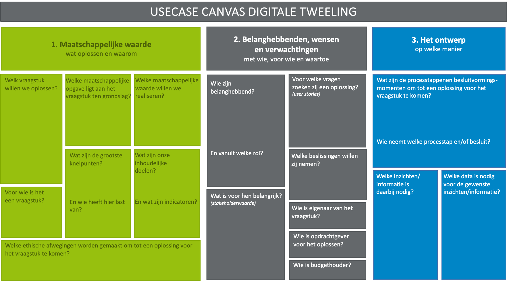
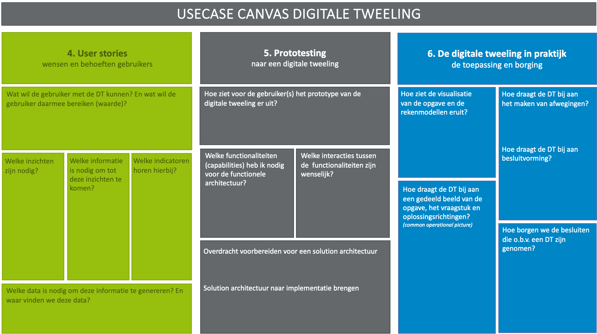
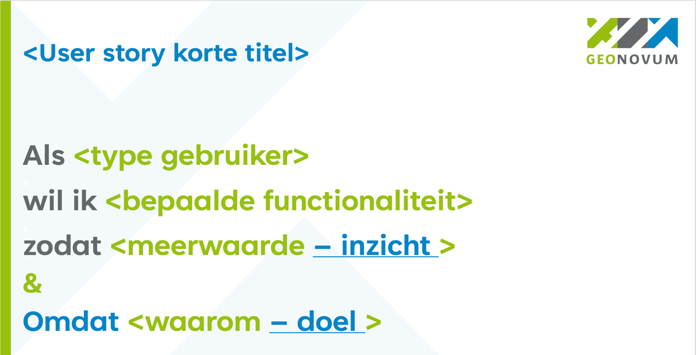
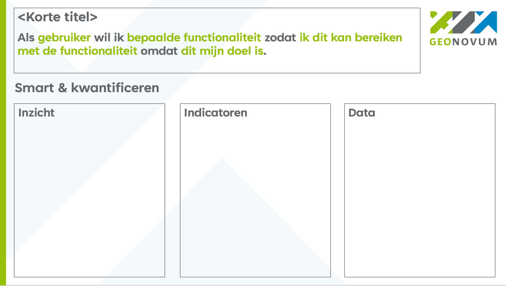
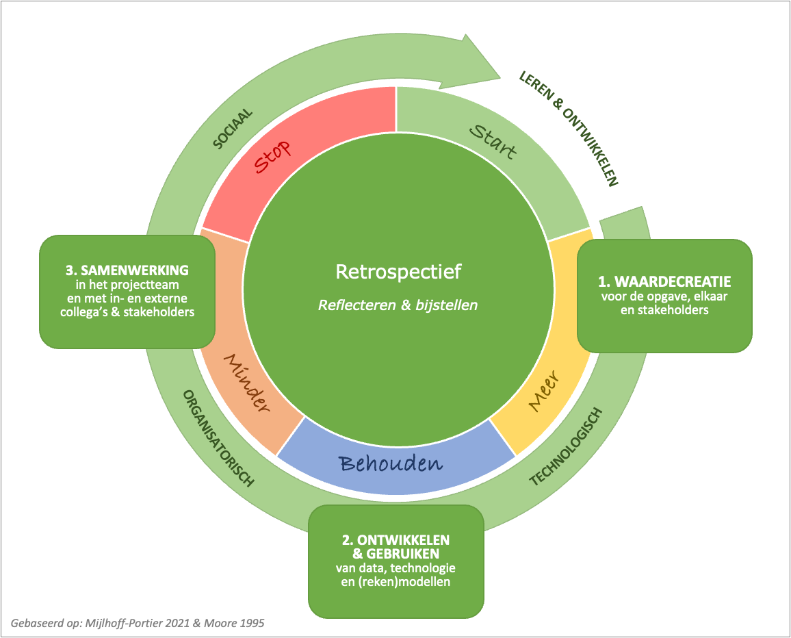

# Bijlagen {#55D07161}
## Literatuur organisatie- en samenwerkingsvraagstukken {#390066C7}
Braams, R. B., Wesseling, J. H., Meijer, A. J., & Hekkert, M. P. (2024). Civil servant tactics for realizing transition tasks understanding the microdynamics of transformative government. <i>Public Administration</i>, 102(2), 500–518. https://doi.org/10.1111/padm.12933
Crosby, B., ’t Hart, P., & Torfing, J. (2016). <i>Public value creation through collaborative innovation</i>. Public Management Review, 19(5):1-15. DOI: 10.1080/14719037.2016.1192165
De Caluwé, L. en Vermaak, H. (2006). Leren veranderen. Een handboek voor de veranderkundige. 
De Jonge, M., Kuipers-Otten, J. (Eindred.). (2023). <i>Doeboek</i><i>. Opgavegericht Samenwerken.</i> Den Haag: Rijksoverheid, Programma Grenzeloos Samenwerken.
Kaats, E., & Opheij, W. (2012). <i>Leren samenwerken tussen organisaties. Samen bouwen aan allianties, netwerken, ketens en partnerships</i>. Deventer: Kluwer.  
Kwakman, F. & Smeulders, R. (Red.). (2013). <i>Groot Innovatie Modellenboek. 40 Innovatiemodellen voor het versterken van ondernemerschap bij bedrijfsleven en overheid</i>. Culemborg: Van Duuren Management B.V.
Kuhlmann, M. & Hoogendoorn, B. (2008). <i>Implementatiekunst. Gids voor realistisch veranderen</i>. Schiedam: Scriptum Management.
Mazzucato, M. (2015) <i>De ondernemende staat: Waarom de markt niet zonder overheid kan</i>. Amsterdam: Nieuw Amsterdam Uitgevers. 
Mijlhoff-Portier, R. (2021). <i>Koorddansen met asymmetrie. Omgaan met ongelijksoortigheid en ongelijkwaardigheid in een netwerksamenwerking</i>. [Dissertatie, Universiteit Utrecht]. https://dspace.library.uu.nl/, DOI: <a href='https://doi.org/%E2%80%8B10.33540/826' target='_blank'>https://doi.org/​10.33540/826</a> 
Moore, M.H. (1995). <i>Creating Public Value: Strategic Management in Government</i>. Cambridge: Harvard University Press.
Moore, M.H., & Khagram S. (2004). <a href='https://scholar.harvard.edu/markmoore/publications/creating-public-value' target='_blank'><i>On Creating Public Value: What Business Might Learn from Government about Strategic Management</i></a><i>. </i>Corporate Social Responsibility Initiative Working Paper No. 3. Cambridge, MA: John F. Kennedy School of Government, Harvard University. 
Osterwalder, A. & Pigneur, Y. (2009). <i>Business Model Generatie. Een </i><i>handbook</i><i> voor Visionairs, Game </i><i>Changers</i><i> en Uitdagers.</i> Deventer: Kluwer. 
Page, S., Stone, M., Bryson, J., & Crosby, B. (2015). Public Value Creation by cross-sector collaborations: a framework and challenges of Assessment. <i>Public Administration</i>, 93(3): 715-732. DOI:<a href='http://dx.doi.org/10.1111/padm.12161' target='_blank'>10.1111/padm.12161</a>.
Van der Steen, M. (2024). <i>Technologie in de Tussentijd: AI, Publieke Waarde en Democratie</i>. Den Haag: Nederlandse School voor Openbaar Bestuur.
Volberda, H., & Bosma, M. (2011). <i>Innovatie 3.0: Slimmer managen, organiseren en werken.</i> Amsterdam: Mediawerf Uitgevers.
Willems, N., Linck, R., Kaats, E. (2018). <i>Organiseren in en met netwerken.</i> Zeist: 
Vakmedianet Management B.V.
## Literatuur faciliteren van groepsprocessen, workshops en werkvormen {#79AC9716}
De Jonge, M., Kuipers-Otten, J. (Eindred.). (2023). <i>Doeboek</i><i>. Opgavegericht Samenwerken</i> Den Haag: Rijksoverheid, Programma Grenzeloos Samenwerken.
Dirkse-Hulscher, S. & Talen, A. (2018). <i>Het Groot Werkvormenboek 1. Dé inspiratiebron voor resultaatgerichte trainingen, vergaderingen en andere bijeenkomsten</i>. Meppel: Boom.
Dols, R. & Gouwens, J. (2010). <i>50 Werkvormen voor creatieve sessies. Een schatkist vol ideeën voor bijeenkomsten met resultaat.</i> Culemborg: Van Duuren Media B.V.
Kwakman, F. & Smeulders, R. (Red.). (2013). <i>Groot Innovatie Modellenboek. 40 Innovatiemodellen voor het versterken van ondernemerschap bij bedrijfsleven en overheid</i>. Culemborg: Van Duuren Management B.V.
Noordik, A., Blijsie, J. (2008). <i>Hartelijk Gefaciliteerd! Succesvol veranderen met de workshopaanpak. Praktijkboek voor het ontwerpen en faciliteren van workshops in organisaties</i>. Deventer: Kluwer.
Osterwalder, A. & Pigneur, Y. (2009). <i>Business Model Generatie. Een </i><i>handbook</i><i> voor Visionairs, Game </i><i>Changers</i><i> en Uitdagers.</i> Deventer: Kluwer. 
Schlundt Bodien, G.L. & Visser, C.F. (2008). <i>Oplossingsgericht aan de Slag. Grondhouding en Techniek.</i> [Onbekend]: Crystallise Books.
Van Dijk, B. (2004). <i>Beinvloed anderen, begin bij jezelf. Over gedrag en de Roos van </i><i>Leary</i>. Zaltbommel: Thema. 
## Templates {#33BF21C4}
<ul><li>Usecasecanvas</li>
<li>Beleidscyclus</li>
<li>Overzicht met functionaliteiten voor een digitale tweeling</li>
<li>User story</li>
<li>User story smart & kwantificeren</li>
<li>Template vastleggen user stories</li>
<li>Retrospectief (2x)</li>
<li>Template vastleggen leerpunten retrospectief</li>
</ul>
 
 
<b> 
</b><b>Usecasecanvas</b><b> deel 1</b>
 
 
</img>
<b>Usecasecanvas</b><b> deel 2</b>
 
 
</img>
 
 
<b>Beleidscyclus</b>
</img>
 
 
<b>Overzicht met functionaliteiten voor een digitale tweeling</b>
</img>
 
 
<b>User story</b>
 
 
</img>
 
 
<b>User story smart & kwantificeren</b>
 
 
</img>
 
 
<b>User story </b><b>excelsheet</b>
 
 
</img>
<b>Retrospectief</b>
 
 
</img>
 
 
</img>
<b> 
Template vastleggen leerpunten</b>
 
 
</img>
